# **Capítulo II: Requirements Elicitation & Analysis**

## 2.1. Competidores.

* **Verizon Connect (competidor directo):** Es una plataforma de gestión de flotas basada en la nube que ofrece soluciones de localización GPS, optimización de rutas, mantenimiento predictivo y seguridad de vehículos. Está orientada a empresas con flotas medianas y grandes que buscan mejorar la eficiencia logística y reducir costos operativos. Su presencia es fuerte en Estados Unidos, Canadá y Europa, donde atiende sectores como transporte, construcción y distribución.

* **Frotcom (competidor directo):** Es un software de gestión de flotas diseñado para el monitoreo y control de vehículos en tiempo real. Ofrece funcionalidades como geolocalización, análisis de consumo de combustible, control de conductores y planificación de rutas. Se enfoca en empresas medianas y grandes que necesitan mejorar la trazabilidad y eficiencia de sus operaciones de transporte. Tiene presencia internacional, con fuerte adopción en Europa, África y Latinoamérica.

* **Schockwatch (competidor directo):** Es una empresa especializada en dispositivos y etiquetas sensibles a impactos y vibraciones, diseñados para detectar golpes y malas manipulaciones durante el transporte. Sus productos son utilizados en sectores donde la integridad física de la mercancía es crítica, como el farmacéutico, electrónico y de bebidas. Está presente globalmente, con una amplia red de distribuidores en América, Europa y Asia.

### 2.1.1. Análisis competitivo.

| Competitive Analysis Landscape  |  |                                                                                                                                                                                                                                           |                                                                                                                                                                                                |                                                                                                                                                                           |                                                                                                                                                                                     |
| ----- | ----- |-------------------------------------------------------------------------------------------------------------------------------------------------------------------------------------------------------------------------------------------|------------------------------------------------------------------------------------------------------------------------------------------------------------------------------------------------|---------------------------------------------------------------------------------------------------------------------------------------------------------------------------|-------------------------------------------------------------------------------------------------------------------------------------------------------------------------------------|
| **¿Por qué llevar a cabo este análisis?** | Comparar propuestas tecnológicas de mapeo sísmico para identificar ventajas competitivas en accesibilidad, educación y personalización ciudadana. |                                                                                                                                                                                                                                           |                                                                                                                                                                                                |                                                                                                                                                                           |                                                                                                                                                                                     |
|  |  |                                                                                                                                                                                                                                           |                                                                                                                                                                                                |                                                                                                                                                                           |                                                                                                                                                                                     |
|  |  | **GlassGo**                                                                                                                                                                                                                               | **Verizon**                                                                                                                                                                                    | **Frotcom**                                                                                                                                                               | **Shockwatch**                                                                                                                                                                      |
|  |  |                                                                                                                                                                                                    |                                                                                                                                                         |                                                                                                                                    |                                                                                                                                              |
| **Perfil** | **Overview** | Plataforma integral que busca mejorar la seguridad y eficiencia en el transporte de licores en envases de vidrio. Integra seguimiento en tiempo real, optimización de rutas y sensores inteligentes, bajo un modelo de membresía accesible.  | Software global de gestión de flotas. Ofrece rastreo GPS, reportes de comportamiento del conductor, optimización de rutas y cumplimiento de mantenimiento preventivo para todo tipo de vehículos. | Sistema europeo de control de flotas. Permite monitorear ubicación, consumo de combustible, rendimiento de conductores y planificación de rutas para empresas de transporte. | Especialista en sensores de impacto y temperatura. Sus etiquetas y dispositivos registran vibraciones y golpes en el transporte de mercancías frágiles, reduciendo pérdidas por daños. |
|  | **Ventaja competitiva   ¿Qué valor ofrece a los clientes?** | Trazabilidad completa de los envíos, prevención de roturas mediante sensores, optimización logística y modelo de suscripción accesible para empresas de cualquier tamaño.                                                                 | Cobertura global y herramientas avanzadas para flotas de gran escala.                                                                                                                          | Simplicidad en monitoreo y costos adaptados a medianas empresas de transporte.                                                                                            | Protección específica para mercancía frágil mediante dispositivos de impacto.                                                                                                       |
| **Perfil de Marketing** | **Mercado objetivo** | Transportista, distribuidores y dueños de negocios de licores que requieren seguridad y eficiencia en envases de vidrio.                                                                                                                  | Grandes corporaciones con flotas diversas y necesidades de control total.                                                                                                                      | PYMES de transporte y logística en crecimiento.                                                                                                                           | Empresas que mueven productos delicados (electrónica, vidrio, alimentos premium).                                                                                                   |
|  | **Estrategias de marketing** | Estrategia digital, alianzas con distribuidores y demostraciones en ferias de bebidas y logística.                                                                                                                                        | Campañas globales, webinars y ventas consultivas B2B.                                                                                                                                          | Distribuidores locales, demostraciones personalizadas y soporte posventa.                                                                                                 | Catálogos especializados, distribuidores industriales y presencia en eventos de embalaje.                                                                                           |
| **Perfil de Producto** | **Productos & Servicios** | Plataforma SaaS con dashboard, sensores inteligentes de impacto, alertas en tiempo real y reportes analíticos.                                                                                                                            | Software de gestión de flotas, telemetría avanzada, informes de rendimiento.                                                                                                                   | Módulos de rastreo GPS, consumo de combustible y planificación de rutas.                                                                                                  | Indicadores visuales y sensores electrónicos para detectar golpes y vibraciones.                                                                                                    |
|  | **Precios & Costos** | Membresía mensual escalable según número de vehículos y sensores.                                                                                                                                                                         | Licencias por vehículo \+ instalación.                                                                                                                                                         | Cuota por dispositivo y servicio mensual.                                                                                                                                 | Venta directa de dispositivos y kits.                                                                                                                                               |
|  | **Canales de distribución (Web y/o Móvil)** | Plataforma web y app móvil.                                                                                                                                                                                                               | Web y apps móviles integradas.                                                                                                                                                                 | Web y app móvil ligera.                                                                                                                                                   | Web corporativa y distribuidores físicos.                                                                                                                                           |
| **Análisis FODA** | **Fortalezas** | Solución especializada en licores en vidrio, integración de trazabilidad, prevención de roturas y optimización en un solo sistema.                                                                                                        | Experiencia global y robustez en telemetría.                                                                                                                                                   | Facilidad de uso y soporte cercano.                                                                                                                                       | Precisión en control de impactos.                                                                                                                                                   |
|  | **Oportunidades** | Alianzas con bodegas y distribuidores; integración con aseguradoras; expansión regional.                                                                                                                                                  | Ajustar planes para sectores específicos (bebidas).                                                                                                                                            | Ampliar servicios para transporte delicado.                                                                                                                               | Desarrollar sensores conectados con plataformas logísticas.                                                                                                                         |
|  | **Debilidades** | Necesidad de educar al mercado sobre su propuesta innovadora.                                                                                                                                                                             | Costos altos para PYMES.                                                                                                                                                                       | Funciones limitadas para mercancía frágil.                                                                                                                                | Falta de trazabilidad integral y optimización de rutas.                                                                                                                             |
|  | **Amenazas** | Entrada de grandes players de fleet management al nicho de mercancía frágil.                                                                                                                                                              | Competencia de soluciones más económicas.                                                                                                                                                      | Avance de herramientas gratuitas de rastreo.                                                                                                                              | Copias de bajo costo sin soporte técnico.                                                                                                                                           |

### 2.1.2. Estrategias y tácticas frente a competidores.

**Enfoque Estratégico de GlassGo**

GlassGo se posiciona como la solución integral para el transporte de licores en envases de vidrio, combinando seguimiento GPS, optimización de rutas y sensores inteligentes para minimizar pérdidas por roturas y garantizar transparencia en la cadena logística. A diferencia de los softwares de gestión de flotas genéricos o dispositivos aislados de monitoreo de impacto, GlassGo está especializado en un sector altamente sensible y rentable, con un modelo de membresía flexible y accesible para empresas de cualquier tamaño.

**1\. Frente a Verizon Connect**

* **Estrategia de nicho accesible:** Dirigido a PYMEs del sector de bebidas y distribución con presupuestos limitados, ofreciendo una alternativa más económica y especializada frente a las soluciones de alto costo de Verizon Connect.
* **Táctica de modelo flexible:** Implementación de un esquema de suscripción tipo Netflix, que permite acceso a herramientas avanzadas sin grandes inversiones iniciales.
* **Optimización de adopción tecnológica:** Plataforma de fácil integración y sin necesidad de personal técnico especializado, reduciendo tiempos de implementación.
* **Soporte personalizado:** Acompañamiento local con atención directa a transportistas y distribuidores, fortaleciendo la cercanía y fidelización del cliente.

**2\. Frente a Frotcom**

* **Estrategia de especialización funcional:** Enfoque exclusivo en mercancías frágiles, ofreciendo mayor profundidad en trazabilidad y prevención de roturas frente a la oferta generalista de Frotcom.
* **Táctica de integración avanzada:** Combinación de seguimiento GPS, sensores de impacto y análisis predictivo en un solo entorno digital.
* **Simplicidad operativa:** Interfaz intuitiva diseñada para el personal de transporte, evitando procesos complejos y mejorando la eficiencia operativa.
* **Valor agregado sectorial:** Implementación de funcionalidades específicas para el transporte de vidrio y bebidas premium, mejorando la calidad del servicio y reduciendo pérdidas.

**3\. Frente a Schockwatch**

* **Estrategia de trazabilidad inteligente:** Evolucionar más allá del control pasivo de impactos mediante un sistema que registre, analice y optimice cada etapa del transporte.
* **Táctica de conectividad total:** Integración de los sensores de impacto con la plataforma GlassGo, generando alertas en tiempo real y rutas alternativas ante incidentes.
* **Optimización logística:** Aplicación de algoritmos de rutas seguras para minimizar movimientos bruscos y evitar roturas durante el trayecto.
* **Propuesta integral:** Unificar en una sola solución el monitoreo físico, la trazabilidad digital y la gestión de desempeño logístico, superando la oferta fragmentada de Schockwatch.

## 2.2. Entrevistas.

### 2.2.1. Diseño de entrevistas.

* **Segmento 1: Empresas de transporte de camiones**
    * **Preguntas de descubrimiento:**
        * ¿Cuál es su nombre completo y edad?
        * ¿Cuál es su cargo en la empresa y su tiempo de servicio actual?
        * ¿Podría contarme brevemente sobre su negocio de camiones transportistas? (ubicación, mercancía principal de transporte, flota actual de la empresa)
        * ¿Quiénes son sus clientes principales (distribuidores, bares, licorerías, supermercados)?
        * ¿En qué épocas del año se incrementa la demanda de transporte?
        * ¿Qué dispositivos electrónicos utilizan para coordinar rutas y entregas? (smartphone, tablet, computadora)
        * ¿Qué marcas o plataformas utilizan actualmente para el seguimiento de la flota?

    * **Preguntas principales:**
        * ¿Cómo evalúan el desgaste logístico (consumo de combustible, mantenimiento, horas hombre) con el sistema actual?
        * ¿Presentan alguna conexión directa con los proveedores?(comunicación)
        * ¿Cómo planifican actualmente las rutas de entrega para optimizar tiempos y costos?
        * ¿Qué tan frecuentes son los problemas de pérdidas o daños durante el transporte?
        * ¿Qué costos adicionales generan estas pérdidas o retrasos para la empresa?
        * ¿Utilizan alguna herramienta de trazabilidad en tiempo real? Si es así, ¿Qué ventajas y limitaciones han encontrado?
        * ¿Qué tipo de información les gustaría recibir en tiempo real sobre cada viaje (estado del vehículo, estado de la carga, posición exacta)?
        * Si existiera una solución que mejore la eficiencia logística, ¿Qué características serían imprescindibles para adoptarla?

* **Segmento 2: Proveedores de licores**
    * **Preguntas de descubrimiento:**
        * ¿Cuál es su nombre completo y edad?
        * ¿Cuál es su cargo o rol dentro del negocio?
        * ¿Podría contarme brevemente sobre el negocio de distribución de licores? (tipo, ubicación, tamaño, años operando, periodos de mayor demanda)
        * ¿Qué tipo de clientes atienden con mayor frecuencia? (bares, licorerías, restaurantes, supermercados)
        * ¿Cuántas entregas de licores realizan en promedio por mes?
        * ¿Qué dispositivos electrónicos utilizan para gestionar pedidos, rutas y entregas? (smartphone, tablet, laptop, PC)
        * ¿Qué marcas, apps o plataformas utilizan actualmente para el seguimiento logístico?

    * **Preguntas principales:**
        * ¿Quiénes suelen coordinar directamente con los transportistas: el área logística, almacén, el dueño?
        * ¿Presentan alguna conexión directa con los dueños de negocios?(comunicación)
        * Cuando hay golpes o demoras, ¿Llegan a enterarse? ¿disponen de alguna manera de obtener esa información necesaria de su carga?
        * ¿Qué indicadores o reportes logísticos les gustaría ver para mejorar el control? (tiempos, impactos, estado de la carga)
        * ¿Qué costos adicionales generan las pérdidas o demoras en las entregas?
        * ¿Qué consecuencias tienen los retrasos en la satisfacción de sus clientes o en su operación logística?
        * ¿Ha llegado a utilizar alguna plataforma tecnológica de gestión para garantizar la trazabilidad de sus pedidos?
        * ¿Qué les haría cambiar o incluir un nuevo servicio/tecnología en su cadena logística?
        * Si existiera una herramienta para reducir pérdidas y garantizar tiempos exactos, ¿Qué características consideraría imprescindibles?

* **Segmento 3: Dueños de negocios**
    * **Preguntas de descubrimiento:**
        * ¿Cuál es su nombre completo y edad?
        * ¿Cuál es su cargo o rol dentro del negocio?
        * ¿Podría contarme brevemente sobre su negocio? (tipo, ubicación, tamaño, años operando, periodos de mayor demanda)
        * ¿Qué dispositivos utiliza más para gestionar pedidos e inventarios (PC, tablet, smartphone)?
        * ¿Qué canales digitales prefiere para comunicarse con proveedores (llamadas, WhatsApp, correo, apps especializadas)?

    * **Preguntas principales:**
        * Cuando realizan pedidos de su producto, ¿Qué tan fácil o difícil les resulta coordinar con los proveedores?
        * ¿Cuáles son los criterios clave al momento de escoger un proveedor?
        * ¿Prefieren hacer pedidos con anticipación o en el momento que surge la necesidad?
        * ¿Qué tanto usan herramientas digitales para la planificación de inventarios y ventas?
        * ¿Qué información consideran esencial recibir al hacer un pedido (confirmación, hora estimada, disponibilidad de stock, trazabilidad)?
        * ¿Cuáles son los problemas más frecuentes que enfrentan con los pedidos (retrasos, falta de stock, cambios de precio, problemas de comunicación)?
        * ¿Cómo les gustaría recibir actualizaciones sobre el estado de sus pedidos (notificaciones automáticas, seguimiento en tiempo real, contacto directo)?
        * ¿Estarían dispuestos a invertir a un servicio que les ofrezca transparencia total y confiabilidad en la entrega?¿ Que más les debería ofrecer para que la adopten?

### 2.2.2. Registro de entrevistas.

* **Segmento 1: Empresas de transporte de camiones**
    * **Entrevista 1:**
        * **Nombres:** Luis Abad
        * **Apellidos:** Palacin Lope
        * **Edad:** 50 años
        * **Distrito:** Santa Anita
        * **Screenshot:**
          ****
        * **Video URL:** [https://upcedupe-my.sharepoint.com/:f:/g/personal/u20211c201\_upc\_edu\_pe/Es8K6\_X\_xsJHrlv-dxhmHkABEHjeQZwvaX-u0im39rLfLQ?e=p8hklN](https://upcedupe-my.sharepoint.com/:f:/g/personal/u20211c201_upc_edu_pe/Es8K6_X_xsJHrlv-dxhmHkABEHjeQZwvaX-u0im39rLfLQ?e=p8hklN)
        * **Timing:** 00:00 \- 10:48
        * **Resumen:**  
          Luis Abad Palacin López, gerente de operaciones de HPL Transport SAC, es un profesional con más de 20 años de experiencia en el rubro del transporte de carga por carretera. A sus 50 años, se caracteriza por una personalidad meticulosa, analítica y orientada a la eficiencia operativa, lo que se refleja en su forma de gestionar procesos y supervisar la flota. Su liderazgo combina disciplina y control logístico con un enfoque preventivo hacia la seguridad vial y el mantenimiento técnico. La empresa cuenta con una flota de camiones en donde transportan principalmente envases y productos terminados de la Cervecería Backus, operando tanto en Lima, provincia y la selva peruana. La ayuda de aliados logísticos son cruciales para seguir ampliando su alcance a nivel nacional, lo que categoriza la comunicación y la planificación, entre la central logística y los conductores del transporte, en un nivel alto e incluso crucial durante temporadas de mayor demanda como fiestas nacionales, Navidad y Año Nuevo.

          Las tecnologías utilizadas por el usuario Luis son la plataforma Frotcom, como herramienta de seguimiento y control de flota, smartphones y computadoras personales con propósitos empresariales con el sistema operativo popular Windows. Herramientas imprescindibles al momento de querer visualizar en tiempo real las unidades, establecer geocercas, definir paradas autorizadas y notificar sobre desvíos no autorizados.

          Adicionalmente, el sistema mencionado es capaz de obtener métricas como consumo de combustible y desgaste de neumáticos. Característica atractiva para el usuario para considerar el contexto completo de la unidad respectiva. A pesar de que la plataforma Frotcom cumple con la mayoría de sus expectativas, menciona como necesidad pendiente sensores de fatiga del conductor y alerta de somnolencia. De este modo, el usuario sentiría una mayor seguridad durante trayectos extensos. En resumen, el usuario presenta una alta confianza en herramientas digitales, pero también con una mirada crítica hacia la innovación mediante mejoras tangibles.

* **Entrevista 2:**
    * **Nombres:** Jordan Paolo
    * **Apellidos:** Palacin Raraz
    * **Edad:** 31 años
    * **Distrito:** Santa Anita
    * **Screenshot:**  
      ****
    * **Video URL:**   
      [**https://upcedupe-my.sharepoint.com/:f:/g/personal/u20211c201\_upc\_edu\_pe/Es8K6\_X\_xsJHrlv-dxhmHkABEHjeQZwvaX-u0im39rLfLQ?e=p8hklN**](https://upcedupe-my.sharepoint.com/:f:/g/personal/u20211c201_upc_edu_pe/Es8K6_X_xsJHrlv-dxhmHkABEHjeQZwvaX-u0im39rLfLQ?e=p8hklN)
    * **Timing: 10:51 \- 40:18**
    * **Resumen:**

      Jordan Paolo Palacín Raraz, de 31 años, trabaja como analista de distribución primaria en Arca Continental Logística donde labora desde hace más de dos años y acumula cinco años y medio de experiencia en el rubro de distribución. Su perfil refleja una personalidad analítica, responsable y metódica, con un fuerte enfoque en la eficiencia operativa y la planificación logística. Muestra una comunicación clara, técnica y centrada en la resolución de problemas, lo que evidencia su conocimiento profundo de los procesos de transporte y abastecimiento nacional. En su puesto, coordina la distribución de productos a nivel nacional, asegurando que las entregas lleguen en el tiempo óptimo y con las cantidades solicitadas. Los principales clientes que atiende son almacenes propios de la compañía y mayoristas siendo sus  picos más altos entre los meses de verano y finales de año.

      Respecto a su entorno tecnológico, utiliza un teléfono móvil Android (Samsung) y una laptop Toshiba T40, herramientas que le permiten mantener una conexión continua con transportistas y proveedores. Dentro de la empresa, emplean la plataforma Geotab, un sistema de GPS que centraliza el monitoreo de flotas a nivel nacional, permitiendo visualizar el tránsito de unidades, generar reportes y dar seguimiento a productos críticos. Sin embargo, reconoce que el sistema presenta limitaciones en zonas accidentadas del país, donde la señal se interrumpe.

      La compañía trabaja con transportistas licitados y terceros, quienes gestionan sus propios costos de mantenimiento y desgaste. Su rol implica asegurar la planificación eficiente de las rutas, priorizando productos críticos y buscando siempre equilibrar los costos de transporte con la utilización máxima de la capacidad de carga (llenar el mayor número posible de pallets por unidad). Explica que el flete pactado con transportistas licitados es más competitivo, mientras que el de terceros suele ser más elevado, por lo que deben optimizar la asignación de rutas según conveniencia y eficiencia.

      En cuanto a los problemas operativos, menciona que las mermas y pérdidas de producto son frecuentes, principalmente debido al tipo de apilamiento y a las condiciones accidentadas de las carreteras. Estas fallas impactan en la retornabilidad de unidades y, por ello, requieren de reportes rutinarios semanales. El usuario valora las tecnologías emergentes como cámaras a bordo para detectar la fatiga del conductor y monitorear incidentes, además de sensores de combustible que permiten identificar robos mediante el análisis de consumo en tiempo real. Considera que estas herramientas representan una evolución necesaria, aunque reconoce que su alto costo limita su adopción por parte de transportistas terceros.

      Finalmente, menciona que la empresa está en proceso de migración al sistema SAP S/4HANA y próximamente al TMS (Transport Management System), con el objetivo de automatizar la planificación de rutas, cubicaje y costos. Reduciendo el tiempo de los procesos analíticos.

* **Entrevista 3:**
    * **Nombre:** Percy Adrián
    * **Edad:** Rojas León
    * **Edad:** 37 años
    * **Distrito: Lima**
    * **Screenshot:**
      ****
    * **Video URL:**

      [**https://upcedupe-my.sharepoint.com/:f:/g/personal/u20211c201\_upc\_edu\_pe/Es8K6\_X\_xsJHrlv-dxhmHkABEHjeQZwvaX-u0im39rLfLQ?e=p8hklN**](https://upcedupe-my.sharepoint.com/:f:/g/personal/u20211c201_upc_edu_pe/Es8K6_X_xsJHrlv-dxhmHkABEHjeQZwvaX-u0im39rLfLQ?e=p8hklN)

    * **Timing: 40:19 \- 46:25**
    * **Resumen:**
  
      Percy Adrián Rojas León, de 37 años, es el director de una empresa de transporte de carga con varios años de experiencia en el rubro. Su personalidad refleja organización, responsabilidad y orientación a resultados, especialmente en el cumplimiento de tiempos de entrega y el cuidado de la mercancía transportada. Dirige una flota mediana de camiones, dedicada principalmente al transporte y distribución de productos de consumo y bebidas hacía bares, licorerías y supermercados, lo que evidencia su inserción en un segmento comercial con alta demanda de puntualidad y conservación del producto.

      El equipo de trabajo que lidera es reducido pero eficiente, con una estructura enfocada en la coordinación logística y la integridad de las entregas. En cuanto al uso de la tecnología, la herramienta principal es el smartphone, empleado tanto por los conductores como por el personal de logística para la comunicación y coordinación diaria. También utilizan computadoras para la gestión general y hojas de cálculo en la planificación semi-manual de rutas, combinando procedimientos tradicionales con recursos digitales básicos.

      El usuario emplea sistemas GPS estándar, los cuales permiten el rastreo de ubicación y monitoreo del avance de las entregas. No obstante, reconoce limitaciones en la automatización y precisión de los datos obtenidos. Identifica como información valiosa la posibilidad de acceder a alertas en tiempo real sobre ubicación, temperatura de la carga, impactos o movimientos bruscos, lo que revela un interés por mejorar la trazabilidad y control de las condiciones del transporte, especialmente en el manejo de botellas y líquidos frágiles. Dichas carencias pueden representar costos adicionales

      Finalmente, el usuario expresa que una solución ideal para su empresa debería caracterizarse por su facilidad de uso, especialmente desde aplicaciones móviles, de modo que tanto él como su equipo puedan integrarse sin necesidad de conocimientos técnicos complejos. Esto refleja una preferencia por tecnologías intuitivas, accesibles y compatibles con dispositivos móviles, consolidando un perfil de usuario pragmático y funcional, que busca eficiencia logística sin sacrificar simplicidad operativa.
  
    
* **Segmento 2: Proveedores de licores**
    * **Entrevista 1:**
        * **Nombre:** Omar
        * **Edad:** 48 años
        * **Distrito:** Arequipa
        * **Screenshot:**  
          **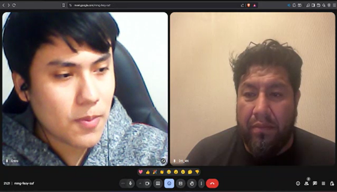**
        * **Video URL:**

          [**https://upcedupe-my.sharepoint.com/:f:/g/personal/u20211c201\_upc\_edu\_pe/Es8K6\_X\_xsJHrlv-dxhmHkABEHjeQZwvaX-u0im39rLfLQ?e=p8hklN**](https://upcedupe-my.sharepoint.com/:f:/g/personal/u20211c201_upc_edu_pe/Es8K6_X_xsJHrlv-dxhmHkABEHjeQZwvaX-u0im39rLfLQ?e=p8hklN)

        * **Timing:** 57:30 \- 01:04:35
        * **Resumen:**
      
          Omar, gerente general de una distribuidora de licores ubicada en la ciudad de Arequipa, cuenta con 18 años de experiencia en el rubro y actualmente lidera un equipo de 35 personas junto a una flota de 12 camiones que atienden principalmente a hoteles, cadenas de restaurantes, licorerías de mediana y gran escala, además de supermercados. A sus 48 años, proyecta una personalidad organizada, con visión estratégica y capacidad de negociación, participando directamente en acuerdos con proveedores e inversiones mientras delega la coordinación logística a un supervisor.   Las mayores demandas de su negocio se concentran en las campañas de julio por fiestas patrias, diciembre por navidad y año nuevo, así como en ferias gastronómicas y eventos corporativos, donde llegan a realizar alrededor de 600 entregas mensuales, lo que representa un 40% de su volumen total en picos de temporada. La empresa opera con computadoras y laptops para tareas administrativas, mientras que los conductores utilizan celulares Android con GPS para reportes y coordinación, apoyándose además en WhatsApp y hojas de cálculo como herramientas complementarias para el control de inventarios y facturación.

          Sin embargo, el entrevistado reconoce que actualmente dependen de reportes tardíos de choferes o reclamos de clientes para identificar incidencias, lo que impacta negativamente en la satisfacción y confianza de clientes clave, obligando a asumir costos adicionales como reposiciones de producto, horas extras, penalidades y envíos urgentes. Dentro de sus expectativas de mejora, considera prioritario implementar soluciones tecnológicas que ofrezcan seguimiento en tiempo real, reportes automáticos y alertas tempranas que permitan anticipar retrasos y reducir pérdidas, siempre con un claro retorno de inversión que justifique la adopción de nuevas plataformas.

    
* **Entrevista 2:**
    * **Nombres:** Adolfo Palacin
    * **Apellidos:** Palacin Lope
    * **Edad:** 46 años
    * **Distrito:** Lima metropolitana
    * **Screenshot:**
      **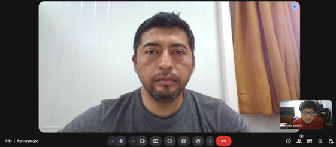**
      **Video URL:**

      [**https://upcedupe-my.sharepoint.com/:f:/g/personal/u20211c201\_upc\_edu\_pe/Es8K6\_X\_xsJHrlv-dxhmHkABEHjeQZwvaX-u0im39rLfLQ?e=p8hklN**](https://upcedupe-my.sharepoint.com/:f:/g/personal/u20211c201_upc_edu_pe/Es8K6_X_xsJHrlv-dxhmHkABEHjeQZwvaX-u0im39rLfLQ?e=p8hklN)

    * **Timing: 46:26 \- 57:28**
    * **Resumen:**
  
       Lulio Adolfo Palacín López, supervisor de transporte en Distribuidora San Martín, cuenta con más de 10 años de experiencia en la gestión logística dentro del sector de distribución de licores. A sus 46 años, se caracteriza por una personalidad organizada y resolutiva, enfocada en la programación de viajes, la coordinación con conductores y la supervisión del correcto traslado de la mercadería hacia clientes como bares, licorerías, restaurantes, pequeños supermercados y minimarkets en Lima.

       La empresa, ubicada en Ate, dispone de una flota de 5 camiones medianos y concentra su mayor volumen de operaciones durante los meses de julio, diciembre y en fechas festivas o fines de semana, alcanzando en promedio 150–160 entregas mensuales. El control logístico se realiza principalmente con herramientas básicas: teléfonos móviles con Android, WhatsApp y Google Maps.

       La comunicación con los conductores es directa y se reportan incidentes mediante fotos o mensajes, aunque en ocasiones con demoras, lo que dificulta la trazabilidad en tiempo real. Las principales preocupaciones identificadas resultan ser la merma de carga, accidentes con su producto y retrasos sobre los tiempos acordados previamente en cada entrega. Estas contingencias impactan en la satisfacción para sus clientes al igual que su credibilidad de su trabajo repercutiendo en cancelaciones o pérdidas de futuras oportunidades.

       Al usar una plataforma digital, considera imprescindible alertas o notificaciones sobre posibles cuellos de botella para evitar demoras. Desea una herramienta económica, sencilla de usar y compatible con dispositivos moviles. Su motivación principal radica en mantener un control más riguroso de las operaciones, reducir pérdidas y asegurar un servicio que refuerce la confianza del cliente.

* **Entrevista 3:**
    * **Nombres:** Luis Javier
    * **Apellidos:** Jiménez Sandoval
    * **Edad:** 52 años
    * **Distrito:** Lima metropolitana
    * **Screenshot:**
      **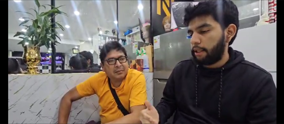**
    * **Video URL:**

      [**https://upcedupe-my.sharepoint.com/:f:/g/personal/u20211c201\_upc\_edu\_pe/Es8K6\_X\_xsJHrlv-dxhmHkABEHjeQZwvaX-u0im39rLfLQ?e=p8hklN**](https://upcedupe-my.sharepoint.com/:f:/g/personal/u20211c201_upc_edu_pe/Es8K6_X_xsJHrlv-dxhmHkABEHjeQZwvaX-u0im39rLfLQ?e=p8hklN)

    * **Timing: 01:04:36 \- 01:14:50**
    * **Resumen:**

      Luis Javier Jiménez Sandoval, empresario limeño de 52 años, cuenta con 28 años de experiencia en la venta y distribución de licores, tanto al por mayor como al por menor, dentro del sector de Lima Metropolitana. Su negocio se caracteriza por una trayectoria consolidada basada en relaciones de confianza, principalmente con bares, restaurantes y licorerías, evitando atender a supermercados debido a los altos volúmenes y exigencias de bonificaciones que estos requieren. En cuanto a la estacionalidad del mercado, Javier explica que los productos de mayor demanda varían según la época del año: los licores espirituosos (whisky, vodka, ron de 40°) registran su mayor venta en otoño e invierno, mientras que las cervezas y bebidas listas para consumir (RTD) dominan las temporadas de primavera y verano. El volumen de distribución fluctúa entre 500 y 1000 cajas mensuales, dependiendo de la estacionalidad.

      Su canal principal de comunicación con los clientes es WhatsApp, descartando el uso del correo electrónico por considerarlo más lento. Afirma que su red de clientes se ha formado a través del boca a boca y las recomendaciones personales, aunque reconoce la necesidad de adaptarse al entorno digital actual, por lo que planea implementar redes sociales como canal de comercialización en el corto plazo. Javier muestra una actitud receptiva hacia la digitalización, manifestando interés en una aplicación móvil que le permita agilizar pedidos, filtrar clientes y garantizar la seguridad en las transacciones. Destaca la importancia de que el sistema implementa filtros de validación como verificación de identidad o registro RUC para evitar fraudes, comparándolo con los sistemas de clasificación usados en servicios como eDriver o aplicaciones telefónicas que identifican llamadas sospechosas.

      En cuanto a su gestión operativa, identifica como una necesidad fundamental conocer el estado de sus pedidos en tiempo real, debido a los retrasos frecuentes en las entregas, especialmente en Lima, donde el tráfico complica la puntualidad de los repartos. Señala que los retrasos generan pérdidas de tiempo y posibles cancelaciones de parte de clientes que recurren a otros distribuidores, afectando su reputación y rentabilidad. Considera que los indicadores logísticos dentro de una aplicación debería permitirles gestionar inventarios, controlar la rotación de productos y exhibir el catálogo disponible para la venta, todo dentro de un entorno seguro y accesible para los clientes verificados.

      El usuario también comentó sus experiencias negativas del rubro como intentos de estafa de clientes y pagos falsos. Por ello, insiste en que cualquier sistema digital debe incluir mecanismos de seguridad y validación de compradores, además de seguimiento georreferenciado de unidades de reparto que permitan visualizar las rutas y el estado de las entregas en tiempo real. Finalmente, recomienda que los desarrolladores de este tipo de plataformas consideren las “variables ocultas” del mercado de licores, como las bonificaciones por volumen, premios de fidelización (viajes, electrodomésticos, autos) y los costos logísticos derivados del tráfico y los retrasos urbanos, para ofrecer un sistema integral que refleje el valor real de la operación.

* **Segmento 3: Dueños de negocios**
    * **Entrevista 1:**
        * **Nombre:** Carla Martinez
        * **Edad:** 33 años
        * **Distrito:** San Juan de Miraflores
        * **Screenshot:**
          **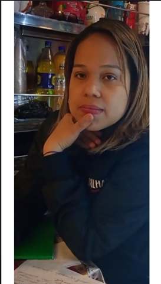**
        * **Video URL:**

          [**https://upcedupe-my.sharepoint.com/:f:/g/personal/u20211c201\_upc\_edu\_pe/Es8K6\_X\_xsJHrlv-dxhmHkABEHjeQZwvaX-u0im39rLfLQ?e=p8hklN**](https://upcedupe-my.sharepoint.com/:f:/g/personal/u20211c201_upc_edu_pe/Es8K6_X_xsJHrlv-dxhmHkABEHjeQZwvaX-u0im39rLfLQ?e=p8hklN)

        * **Timing: 01:21:59 \- 01:25:35**
        * **Resumen:**

          Carla Martinez, administradora de un negocio con tres años de operación en el sector de ventas minoristas, refleja una personalidad organizada y enfocada en el control del inventario. A sus 33 años, combina la disciplina en la gestión con un estilo de liderazgo práctico, apoyándose en herramientas digitales básicas para coordinar los procesos de abastecimiento. El negocio utiliza principalmente la computadora de escritorio (PC) para la gestión de pedidos e inventarios, mientras que para la comunicación con los proveedores se emplean canales como llamadas telefónicas, correos electrónicos y WhatsApp, lo que permite un contacto directo y constante.
        * 
          Dentro de sus criterios de selección de proveedores, Carla prioriza la confianza, la calidad y la trayectoria de la marca en el mercado, destacando que siempre prefiere realizar pedidos con anticipación para garantizar disponibilidad de productos. Sin embargo, menciona que la coordinación puede ser tanto fácil como complicada, debido al análisis constante de la demanda y el control de los artículos más solicitados. Entre los principales problemas enfrentados por el negocio están los retrasos en las entregas, la falta de ciertos productos y los cambios repentinos en los precios.

          Para ella, resulta fundamental recibir confirmaciones claras de envío y conocer los horarios exactos de llegada de los pedidos. Asimismo, considera que contar con un sistema de seguimiento en tiempo real aumentaría la confianza y transparencia en el proceso. Finalmente, Carla expresa disposición a invertir en un servicio que ofrezca transparencia, confiabilidad y puntualidad, siempre que esté alineado con la misión de brindar un servicio de calidad a la sociedad.

* **Entrevista 2:**
    * **Nombre:** Alejandro
    * **Apellido:** Rodrigez
    * **Edad:** 37 años
    * **Distrito:** Lima metropolitana
    * **Screenshot:**
      **![cap2]/assets/images/cap2/Entrevista3.2.png)**
    * **Video URL:**

      [**https://upcedupe-my.sharepoint.com/:f:/g/personal/u20211c201\_upc\_edu\_pe/Es8K6\_X\_xsJHrlv-dxhmHkABEHjeQZwvaX-u0im39rLfLQ?e=p8hklN**](https://upcedupe-my.sharepoint.com/:f:/g/personal/u20211c201_upc_edu_pe/Es8K6_X_xsJHrlv-dxhmHkABEHjeQZwvaX-u0im39rLfLQ?e=p8hklN)

    * **Timing: 01:14:52 \- 01:21:57**
    * **Resumen:**

      Alejandro Rodríguez, de 37 años, es propietario de un bar de tamaño mediano ubicado en Lima, con varios años de funcionamiento. Su negocio se orienta a un público joven y adulto joven. Alejandro proyecta una personalidad organizada, analítica y con interés en mantener control operativo, aunque delega parte de la gestión a su equipo. Muestra predisposición al uso de la tecnología, aunque prefiere mantener una supervisión directa de los procesos administrativos.

      En cuanto al uso de tecnología, su dinámica de trabajo se apoya principalmente en smartphones y laptops. Los smartphones se emplean para la coordinación rápida de inventarios y pedidos, mientras que la laptop es su herramienta preferida para redactar reportes, realizar facturación y revisar detalles administrativos. No menciona el uso de software especializado, sino herramientas comunes y accesibles, lo que indica un nivel medio de digitalización.

      Alejandro utiliza WhatsApp como medio principal para interactuar con proveedores, destacando su rapidez y practicidad. Para proveedores más grandes o con mayor formalidad, recurre al correo electrónico o a los perfiles corporativos de las empresas, lo que refleja adaptabilidad según el tipo de interlocutor. Son herramientas con procesos lentos o no estandarizados para adoptarlo como regla dentro de un negocio formal.

      Por consiguiente, el usuario nos indicó como dificultades frecuentes los retrasos en pedidos, cambios de última hora de la llegada de su mercancía, modificaciones de precios sin previo aviso y problemas de productos dañados o mal empacados.

      Alejandro enfatiza la necesidad de confirmaciones inmediatas de pedidos, visibilidad del estado de las entregas en tiempo real y la posibilidad de reportar incidentes o inconvenientes directamente en una plataforma. Muestra especial interés en contar con un sistema integrado y automatizado, con notificaciones automáticas, checklists previos a despachos y seguimiento centralizado de todo el proceso logístico. Considera que esto permitiría reducir errores y mejorar la comunicación con proveedores y repartidores.

      En general, es un usuario pragmático, tecnológicamente activo pero no especializado. Sus hábitos digitales se apoyan en herramientas cotidianas (WhatsApp, correo, laptop), y su visión de mejora está centrada en la automatización y la trazabilidad a favor de su negocio.

* **Entrevista 3:**
    * **Nombre:** Bruno del castillo
    * **Edad:** 27 años
    * **Distrito:** Trujillo
    * **Screenshot:**
      ****
    * **Video URL:**

      [**https://upcedupe-my.sharepoint.com/:f:/g/personal/u20211c201\_upc\_edu\_pe/Es8K6\_X\_xsJHrlv-dxhmHkABEHjeQZwvaX-u0im39rLfLQ?e=p8hklN**](https://upcedupe-my.sharepoint.com/:f:/g/personal/u20211c201_upc_edu_pe/Es8K6_X_xsJHrlv-dxhmHkABEHjeQZwvaX-u0im39rLfLQ?e=p8hklN)

    * **Timing: 01:25:36 \- 01:30:20**
    * **Resumen:**

      Encargado de la logística en una tienda de abarrotes ubicada en Trujillo, lidera un negocio con seis años de operación y una clientela consolidada, especialmente activa en épocas de alta demanda como festividades y fines de semana. A pesar de su juventud, demuestra una personalidad organizada, práctica y con enfoque operativo, combinando responsabilidad administrativa con adaptabilidad ante la presión estacional del mercado.

      En términos tecnológicos, Bruno utiliza el smartphone como herramienta principal para la gestión rápida de pedidos y la comunicación con proveedores, mientras que la PC se emplea para las tareas de inventario. Sin embargo, su gestión de inventarios aún mantiene un componente manual o semi digital, apoyándose en cuadernos o archivos de Excel, lo que evidencia una transición parcial hacia la digitalización.

      En cuanto a los criterios de selección de proveedores, Bruno prioriza la puntualidad, estabilidad de precios, disponibilidad de stock y facilidad de pago, evidenciando una visión pragmática centrada en la fiabilidad operativa. Prefiere planificar los pedidos con anticipación, aunque admite que en ocasiones deben realizar pedidos de emergencia cuando el stock disminuye inesperadamente.

      Entre las dificultades más comunes, menciona los retrasos en las entregas, falta de stock, comunicación deficiente y cambios sin previo aviso, factores que afectan la eficiencia logística y la capacidad de respuesta ante la demanda.

      Finalmente, se muestra abierto a invertir en soluciones tecnológicas que aporten transparencia, confiabilidad y trazabilidad, valorando funciones como el historial de compras, reportes de gastos, pagos en línea y alertas personalizadas. Este perfil evidencia una mentalidad proactiva y moderna, dispuesta a adoptar herramientas digitales que integren los procesos de gestión y mejoren la eficiencia general del negocio.

### 2.2.3. Análisis de entrevistas.

El análisis de entrevista profundiza en la comprensión de las necesidades o comportamientos de nuestros usuarios. Esto se considera de gran peso para la orientación de nuestras decisiones sobre diseño y desarrollo de un producto atractivo y útil para dicho público.

* **Segmento 1: Empresas de transporte de camiones**

  Se analizaron entrevistas a gerentes de operaciones de empresas transportistas que utilizan herramientas digitales básicas para coordinar sus flotas. La información permitió identificar características objetivas y subjetivas clave para la planificación del proyecto.

| Característica | Mención | % | Evidencia |
| ----- | :---: | :---: | ----- |
| Uso de smartphones Android como herramienta principal de coordinación | 3/3 | 100% | Los tres entrevistados mencionan el uso de teléfonos móviles Android para comunicación, coordinación y seguimiento de rutas. |
| Uso de hojas de cálculo (Excel) para planificación o control | 2/3 | 66% | Percy y Luis refieren el uso de hojas de cálculo para planificar rutas y monitorear operaciones administrativas. |
| Empleo de sistemas GPS para rastreo de flotas | 3/3 | 100% | Todos utilizan GPS: Luis (Frotcom), Jordan (Geotab) y Percy (GPS básico).  |
| limitaciones tecnológicas por costo o falta de capacitación  | 2/3 | 66% | Luis y Percy mencionan que los costos y la capacitación son obstáculos para implementar nuevas herramientas digitales. |
| Interés en monitoreo avanzado (alertas de temperatura, impactos, fatiga del conductor) | 3/3 | 100% | Todos expresan interés en contar con datos más detallados y sensores que garanticen seguridad y trazabilidad. |
| Predisposición positiva hacia la digitalización con enfoque práctico | 3/3 | 100% | Todos valoran la tecnología, pero priorizan la utilidad y el retorno operativo sobre la complejidad del sistema.  |
| Interés en integrar sistemas más robustos (TMS, SAP, Frotcom) | 2/3 | 66% | Luis utiliza Frotcom y Jordan está en proceso de migración hacia SAP S/4HANA y TMS para automatizar procesos. |
| Uso de computadoras con sistema Windows | 3/3 | 100% | Se menciona explícitamente el uso de laptops o PCs con Windows para gestiones logísticas y administrativas. |
| Problemas frecuentes: mermas o daños en la carga | 3/3 | 100% | Mencionan pérdidas o daños por malas condiciones de camino, manejo o apilamiento deficiente. |
| Alta experiencia en el rubro de transporte y distribución | 3/3 | 100% | Todos superan los 5 años de experiencia en transporte, logística o distribución a nivel nacional. |

* **Insights;**
    * Aunque las empresas utilizan GPS o plataformas digitales, el smartphone Android sigue siendo la herramienta central para la coordinación diaria. Esto evidencia una digitalización práctica pero aún limitada, centrada en la comunicación más que en la automatización.
    * Los tres gerentes valoran las soluciones tecnológicas que aporten eficiencia tangible sin requerir procesos complejos. Esto sugiere que el mercado está preparado para herramientas intuitivas y modulares antes que por sistemas de gran escala.
    * La recurrencia de pérdidas por apilamiento deficiente o carreteras en mal estado refleja la falta de integración entre monitoreo digital y gestión física de las operaciones, abriendo espacio para sistemas predictivos o de alerta temprana.

* **Segmento 2: Proveedores de licores**

  Se analizaron entrevistas a dos distribuidores con amplia experiencia logística. Ambos presentan prácticas similares pese a diferencias en el tamaño de sus flotas.

| Característica | Mención | % | Evidencia |
| ----- | :---: | :---: | ----- |
| Uso de smartphones Android y WhatsApp para coordinar entregas y pedidos | 3/3 | 100% | Todos los entrevistados mencionan el uso de teléfonos móviles y WhatsApp como herramientas clave de comunicación entre conductores, clientes y supervisores.  |
| Uso de computadoras o laptops para tareas administrativas | 3/3 | 100% | Los tres entrevistados reportan emplear computadoras para la gestión de inventarios, facturación o contabilidad. |
| Dependencia de reportes manuales o tardíos sobre incidencias | 2/3 | 66% | Omar y Lulio afirman que los incidentes se reportan mediante mensajes o fotos, a menudo con demoras. |
| Valoración del retorno de inversión (ROI) como criterio de adopción tecnológica | 2/3 | 66% | Omar y Luis Javier enfatizan que las nuevas tecnologías deben justificar su costo mediante beneficios medibles. |
| Interés en seguridad digital y validación de clientes o pedidos | 1/3 | 33% | Luis Javier menciona la necesidad de filtros de validación y mecanismos antifraude en plataformas digitales. |
| Reconocimiento de pérdidas y mermas por fallas logísticas o incidentes | 2/3 | 66% | Omar y Lulio reportan pérdidas de producto y accidentes como problemas frecuentes.  |
| Falta de trazabilidad o monitoreo en tiempo real  | 3/3 | 100% | Los tres coinciden en la necesidad de soluciones que brinden seguimiento continuo y alertas ante retrasos o incidencias. |
| Experiencia consolidada en el rubro de distribución | 3/3 | 100% | Todos superan los 10 años en el sector, con cargos de liderazgo o supervisión logística.  |

* **Insights:**
    * La tecnología se usa más para comunicación y gestión básica que para control logístico integral; aún predomina la dependencia de hojas de cálculo y reportes manuales.
    * Algunos actores, especialmente los más digitalizados, demandan sistemas con validación antifraude y monitoreo de pedidos para evitar estafas o entregas fallidas.
    * A pesar de décadas de experiencia, los líderes del segmento aún no cuentan con herramientas de gestión automatizada que integren la información logística y comercial.

* **Segmento 3: Dueños de negocios**

  Este segmento corresponde a pequeños comerciantes minoristas con entre 2 y 3 años de experiencia consolidando su negocio propio.

| Característica | Mención | % | Evidencia |
| ----- | :---: | :---: | ----- |
| Perfil organizado y orientado al control operativo | 3/3 | 100% | Los tres entrevistados priorizan la planificación, el control de inventarios y la gestión directa de pedidos. |
| Uso de tecnología básica o media (sin sistemas especializados) | 3/3 | 100% | Utilizan PC, laptops y smartphones para sus operaciones; ninguno emplea software especializado de gestión logística. |
| Valoran la confianza, puntualidad y comunicación con proveedores | 3/3 | 100% | La fiabilidad, cumplimiento y claridad en la información son criterios esenciales para elegir y mantener proveedores. |
| Motivación por mantener la calidad del servicio y reputación del negocio | 3/3 | 100% | Asocian la eficiencia tecnológica con la satisfacción del cliente final y la imagen profesional de su negocio. |
| Interés en automatizar o digitalizar la gestión de pedidos | 3/3 | 100% | Desean mejorar la trazabilidad, recibir alertas y tener visibilidad en tiempo real del estado de los pedidos. |
| Preferencia por herramientas conocidas y de fácil acceso | 3/3 | 100% | Emplean WhatsApp, llamadas y correo electrónico; evitan procesos complejos o plataformas de difícil uso. |
| Preocupación constante por los retrasos y cambios inesperados | 3/3 | 100% | Mencionan los retrasos, precios variables y problemas de comunicación como los principales dolores del proceso logístico. |
| Apertura a invertir en soluciones tecnológicas si generan valor tangible | 2/3 | 66% | Carla y Bruno indican que estarían dispuestos a invertir en sistemas que aporten transparencia y control operativo. |
| Gestión de inventario semi-digital o manual | 2/3 | 66% | Bruno y Carla aún registran parte de sus inventarios con métodos tradicionales o archivos Excel. |
| Necesidad de confirmaciones y seguimiento en tiempo real | 3/3 | 100% | Todos consideran crucial contar con notificaciones automáticas y confirmaciones de entrega para reducir la incertidumbre. |

* **Insights:**
    * Los dueños de negocios quieren visualizar el estado de sus pedidos, entregas y confirmaciones en tiempo real.
    * Existe dependencia fuerte de WhatsApp como canal de gestión con proveedores, lo que podría integrarse dentro de la propuesta de GlassGo.
    * Su necesidad está menos en la flota y más en la gestión del inventario y previsión de compras, lo cual puede resolverse con reportes claros y simples.

## 2.3. Needfinding.

### 2.3.1. User Personas.

En esta sección se presentan tres User Personas que representan los segmentos clave del proyecto: los Transportistas de carga, las Distribuidoras de licores y los dueños de bares y licorerías. Estos perfiles permiten comprender en profundidad las necesidades, motivaciones, frustraciones y comportamientos de los usuarios potenciales del sistema GlassGo, una plataforma que busca mejorar la trazabilidad, la eficiencia y la seguridad en el transporte de licores en envases de vidrio en el Perú.

* **Segmento 1: Empresas de transporte de camiones**

El User Persona Jorge Mendoza representa a los transportistas independientes de carga pesada, encargados de trasladar bebidas entre distintas ciudades del país. Jorge tiene más de veinte años de experiencia en el rubro y trabaja con una flota envejecida que le genera dificultades operativas y pérdidas por rotura de botellas. Ha probado algunas herramientas de geolocalización, pero ninguna se adapta realmente a las condiciones de las rutas locales ni a su nivel de familiaridad digital. Su principal motivación es optimizar las rutas y reducir los costos de combustible y mantenimiento, logrando entregas puntuales que le permitan mantener su reputación y contratos. Busca una solución simple, accesible y confiable que le permita monitorear su carga sin depender de procesos manuales o llamadas telefónicas.  
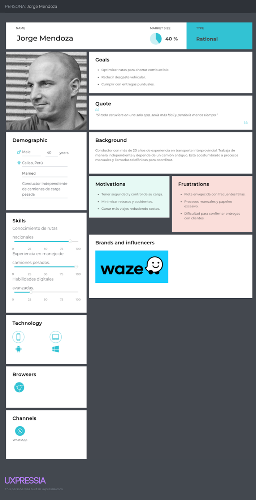

* **Segmento 2: Proveedores de licores**

El User Persona Andrea Flores representa a las distribuidoras de licores, responsables de garantizar que los pedidos lleguen completos y en buen estado. Andrea gestiona la logística de distribución para bares y restaurantes en Lima, y con frecuencia enfrenta pérdidas por robos parciales o botellas dañadas durante el transporte. Aunque ha implementado algunos sistemas de control, estos suelen ser costosos o poco adaptables a las necesidades de su empresa. Su motivación principal es contar con trazabilidad total de la carga y minimizar los riesgos en cada entrega, asegurando la confianza de sus clientes. Busca una plataforma que le ofrezca visibilidad en tiempo real, alertas automáticas y reportes simples que le permitan tomar decisiones rápidas sin depender de múltiples canales de comunicación.  
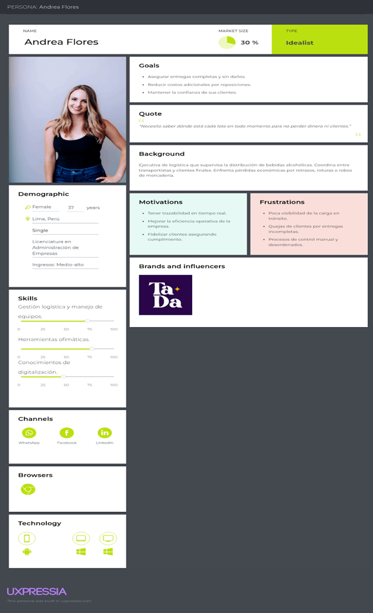

* **Segmento 3: Dueños de negocios**

Por su parte, el User Persona José Álvarez representa a los dueños de bares y licorerías, quienes dependen de la puntualidad de sus proveedores para mantener el flujo de ventas. José administra un bar en Miraflores y ha tenido que lidiar con entregas tardías o incompletas que afectan directamente su inventario y promociones. Ha intentado llevar un control de pedidos mediante hojas de cálculo y mensajería, pero estos métodos le resultan ineficientes y poco precisos. Su motivación principal es contar con un sistema que le brinde transparencia y puntualidad en los pedidos, permitiéndole planificar mejor sus compras y evitar pérdidas por falta de stock. Busca una herramienta intuitiva, visual y de fácil acceso que le permita recibir notificaciones de entrega en tiempo real y mantener comunicación directa con sus proveedores.  

### 2.3.2. User Task Matrix.

En esta sección se presenta el *User Task Matrix*, que reúne las tareas que los **User Personas** (representativos de cada segmento) realizan para alcanzar sus objetivos operativos, independientemente de la existencia de una solución tecnológica.

Los segmentos considerados para este análisis son:

* **Empresas de transporte de camiones**
* **Distribuidores de licores**
* **Dueños de negocios (bares/licorerías)**

| Tarea | Andrea Flores |  | José Alvarez |  | Jorge Mendoza |  |
| ----- | :---: | :---: | :---: | :---: | :---: | :---: |
|  | **Frecuencia** | **Importancia** | **Frecuencia** | **Importancia** | **Frecuencia** | **Importancia** |
| **Planificar rutas de transporte eficientes** | Often | High | Rarely | Always | Always | High |
| **Monitorear ubicación y estado de la carga** | Always | High | Sometimes | High | Always | High |
| **Coordinar entregas con clientes o puntos de destino** | Always | High | Often | Medium | Often | High |
| **Registrar incidencias durante el transporte** | Often | High | Rarely | Medium | Often | High |
| **Supervisar condiciones de la carga (roturas, pérdidas)** | Always | High | Often | High | Always | High |
| **Gestionar reportes y documentos logísticos** | Often | High | Sometimes | Medium | Often | Medium |
| **Mantener comunicación directa con conductores o proveedores** | Always | High | Always | High | Always | High |
| **Controlar inventario de productos transportados** | Always | High | Always | High | Sometimes | Medium |
| **Evaluar desempeño de entregas (tiempo, cumplimiento)** | Often | High | Sometimes | Medium | Sometimes | Medium |
| **Buscar herramientas digitales para mejorar la trazabilidad** | Often | High | Sometimes | Medium | Sometimes | High |
| **Gestionar reclamos o incidencias con clientes** | Often | High | Sometimes | Medium | Sometimes | Medium |
| **Planificar compras o reposiciones de stock** | Sometimes | Medium | Always | High | Rarely | Low |
| **Garantizar puntualidad y cumplimiento de pedidos** | Always | High | Always | High | Often | High |
| **Analizar costos operativos y pérdidas por rotura** | Often | High | Always | Medium | Often | High |

**Coincidencias clave entre segmentos:**

* Todos los perfiles valoran la puntualidad, trazabilidad y comunicación en tiempo real, aunque con distinto enfoque.
    * Para el transportista, significa control operativo.
    * Para el distribuidor, significa confianza y cumplimiento.
    * Para el dueño de bar, significa seguridad y planificación de stock.
* La prevención de roturas y pérdidas es una prioridad transversal, especialmente para los dos primeros segmentos.
* La necesidad de información clara y actualizada (ubicación, incidencias, entregas) aparece como requisito común y de alta importancia.

**Diferencias:**

* Los transportistas priorizan la optimización de rutas y la reducción de costos logísticos.
* Las distribuidoras concentran su atención en la trazabilidad completa y la relación con el cliente final.
* Los dueños de negocios valoran más la transparencia y notificaciones en tiempo real que la gestión logística profunda.

### 2.3.3. User Journey Mapping.

* **Segmento 1: Empresas de transporte de camiones**

  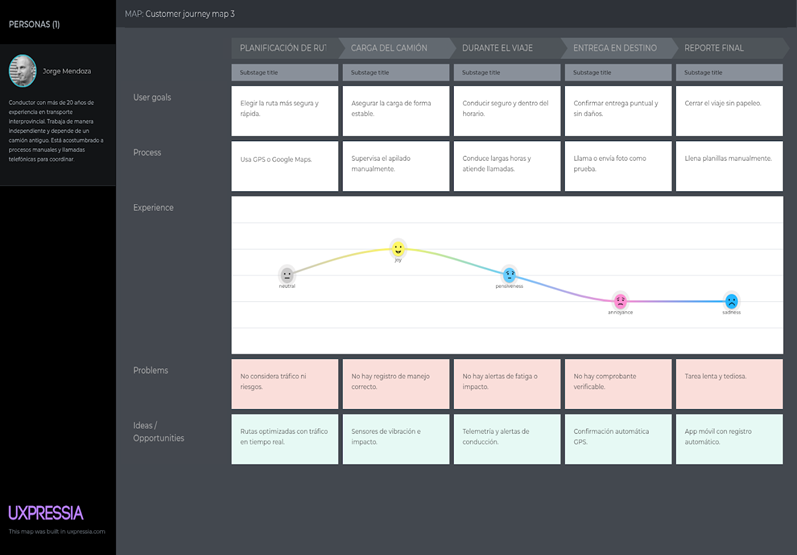

* **Segmento 2: Proveedores de licores**

  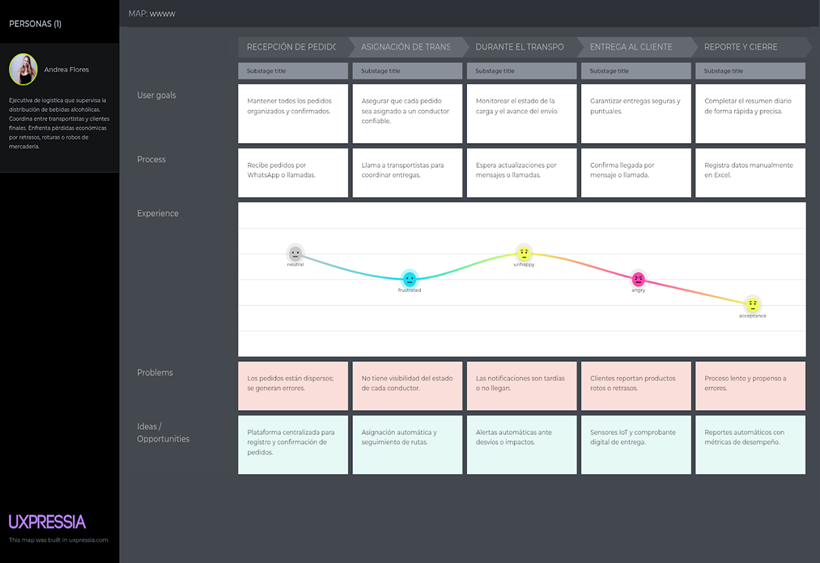

* **Segmento 3: Dueños de negocios**

  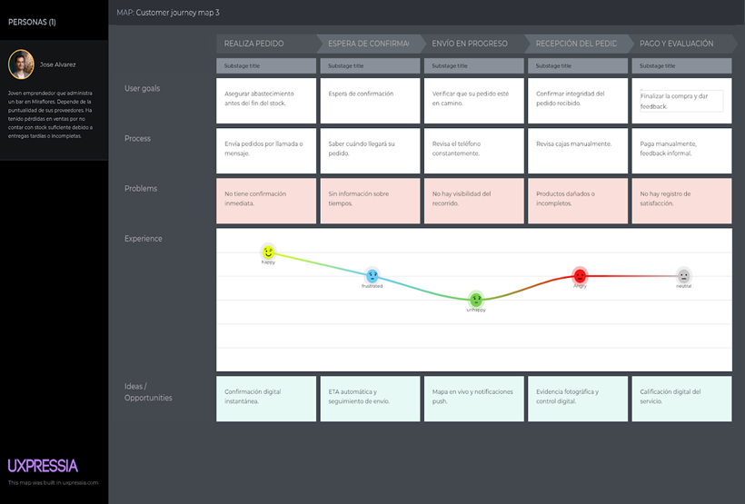

### 2.3.4. Empathy Mapping.

* **Segmento 1: Empresas de transporte de camiones**

  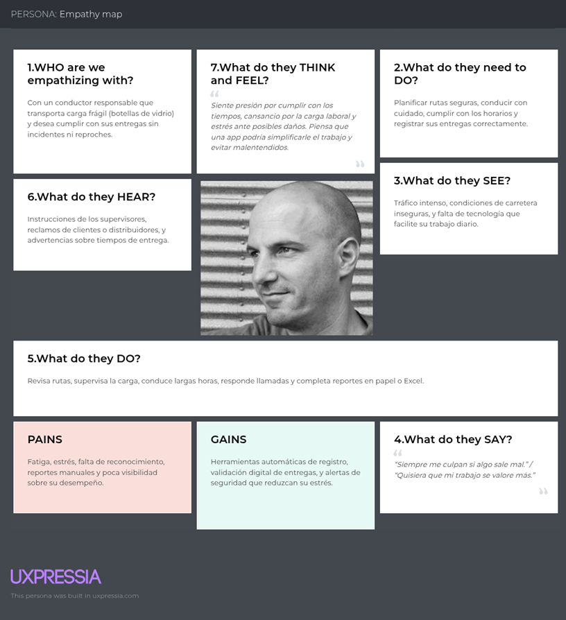

* **Segmento 2: Proveedores de licores**

  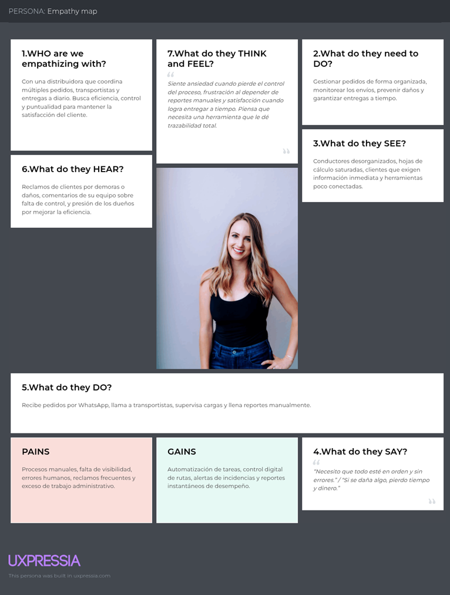

* **Segmento 3: Dueños de negocios**

  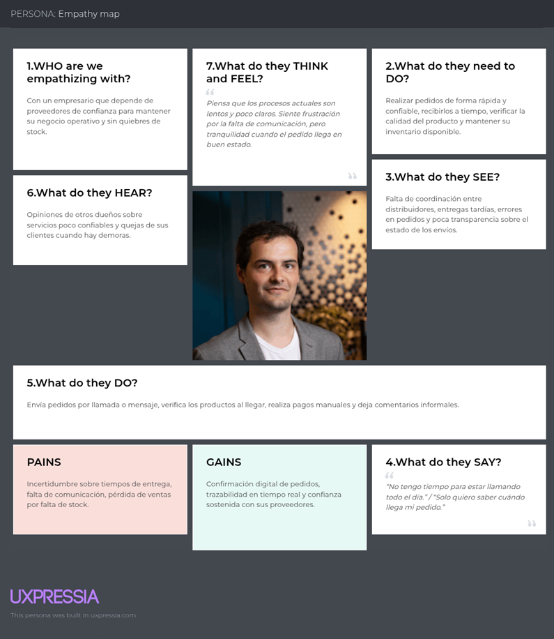

## 2.4. Big Picture Event Storming.

  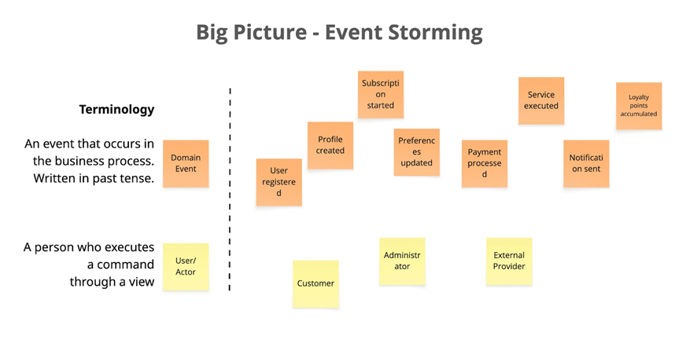

## 2.5. Ubiquitous Language.

revisión

| Identity & Access Management |  |  |
| :---- | :---- | :---- |
| **Term (English)** | **Term (Spanish)** | **Definition (in Spanish)** |
| User | Usuario | Persona que interactúa con la aplicación. Puede ser cliente o administrador. |
| Register User | Registrar usuario | Acción de crear una cuenta nueva en el sistema. |
| Login | Iniciar sesión | Proceso de autenticación para acceder al sistema. |
| Credentials | Credenciales | Conjunto de datos (correo, contraseña) para la autenticación. |
| User registered | Usuario registrado | Evento que indica que una nueva cuenta ha sido creada. |

| Profiles & Preferences Management |  |  |
| :---- | :---- | :---- |
| **Term (English)** | **Term (Spanish)** | **Definition (in Spanish)** |
| Profile | Perfil | Información personal del usuario (nombre, correo, teléfono, etc.). |
| Preferences | Preferencias | Configuración personalizada definida por el usuario. |
| Profile created | Perfil creado | Evento que indica que se creó un perfil asociado a un usuario. |
| Preferences updated | Preferencias actualizadas | Evento que indica que el usuario cambió su configuración. |

| Payments & Subscriptions |  |  |
| :---- | :---- | :---- |
| **Term (English)** | **Term (Spanish)** | **Definition (in Spanish)** |
| Subscription | Suscripción | Relación activa entre cliente y plan de servicios. |
| Subscription started | Suscripción iniciada | Evento que indica el inicio de un plan contratado. |
| Payment | Pago | Transacción financiera para habilitar un servicio o renovar la suscripción. |
| Payment processed | Pago procesado | Evento que confirma que un pago fue realizado exitosamente. |
| Plan | Plan | Conjunto de servicios con un precio definido. |
| Grace Period | Periodo de gracia | Tiempo extra permitido antes de cancelar un servicio por falta de pago. |

| Service Planning |  |  |
| :---- | :---- | :---- |
| **Term (English)** | **Term (Spanish)** | **Definition (in Spanish)** |
| Service | Servicio | Actividad que la plataforma organiza para atender al cliente. |
| Schedule service | Programar servicio | Acción de definir fecha y hora para un servicio. |
| Service planned | Servicio planificado | Evento que confirma la programación de un servicio. |
| Administrator | Administrador | Actor responsable de planificar y supervisar servicios. |

| Service Execution & Monitoring |  |  |
| :---- | :---- | :---- |
| **Term (English)** | **Term (Spanish)** | **Definition (in Spanish)** |
| Execute service | Ejecutar servicio | Acción de poner en marcha un servicio planificado. |
| Service executed | Servicio ejecutado | Evento que indica que el servicio fue completado. |
| Monitoring | Monitoreo | Proceso de supervisión en tiempo real de los servicios activos. |
| Notification sent | Notificación enviada | Evento que informa al usuario sobre el estado del servicio. |

| Dashboard & Analytics |  |  |
| :---- | :---- | :---- |
| **Term (English)** | **Term (Spanish)** | **Definition (in Spanish)** |
| Dashboard | Panel de control | Vista centralizada con métricas y reportes del sistema. |
| Analytics | Analítica | Proceso de análisis de datos para generar insights. |
| Report | Reporte | Documento con resultados y métricas del negocio. |
| Report generated | Reporte generado | Evento que confirma que se creó un reporte. |

| Loyalty & Engagement |  |  |
| :---- | :---- | :---- |
| **Term (English)** | **Term (Spanish)** | **Definition (in Spanish)** |
| Loyalty Program | Programa de fidelización | Sistema que premia al cliente por su interacción. |
| Loyalty points | Puntos de fidelidad | Beneficios acumulados por el cliente. |
| Accumulate points | Acumular puntos | Acción de añadir puntos al programa de fidelización. |
| Loyalty points accumulated | Puntos de fidelidad acumulados | Evento que indica que los puntos fueron sumados. |

| External Systems |  |  |
| :---- | :---- | :---- |
| **Term (English)** | **Term (Spanish)** | **Definition (in Spanish)** |
| Payment Gateway | Pasarela de pagos | Servicio externo que procesa transacciones financieras. |
| External Provider | Proveedor externo | Actor o empresa que ejecuta servicios subcontratados. |
| Notification Service | Servicio de notificaciones | Sistema externo que envía correos, SMS o push. |
| Logistics Partner | Socio logístico | Entidad que apoya en la ejecución o entrega de servicios. |

