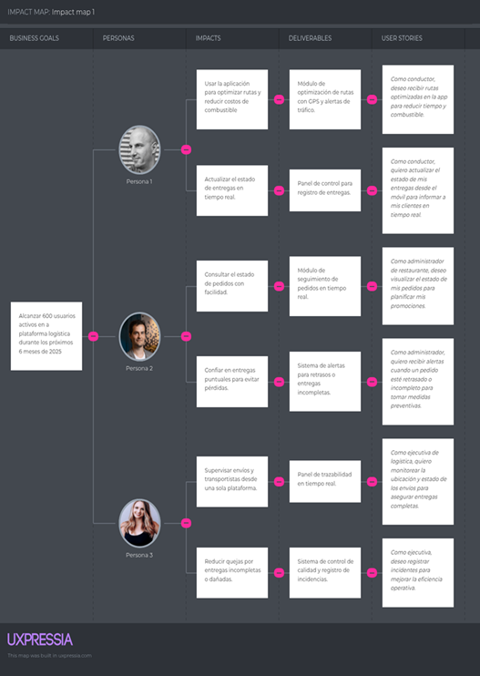

# **Capítulo III: Requirements Specification**

## 3.1. User Stories

User Stories describe system requirements from the end-user perspective, prioritizing the functionality and value that each action provides. In the GlassGo project, stories were formulated based on the needs identified during the user analysis and empathy stages, with the goal of ensuring a consistent, efficient, and human-centered experience for the people interacting with the platform.
Each story clearly defines who the user is, what they want to achieve, and their goal. It also includes verifiable acceptance criteria that ensure compliance with the expected behavior.

| Epic / Story ID | Title | Description | Acceptance Criteria | Related to (Epic ID) |
| :---: | ----- | ----- | :---: | :---: |
| E-1 | Order and Customer Management | As a system, I want to centralize authentication so that different roles can access it securely. | N/A | N/A |
| US-1 | Digital Order Entry | As a distributor, you want to record customer orders in a digital system to have centralized control and reduce manual errors. | Given the distributor accesses the system, when a new order is entered, then the order is correctly stored with the date, customer, and total amount. | E-1 |
| US-2 | Modification of Existing Orders | As a distributor, I want to edit the information of an active order so that I can correct errors or update data before dispatch. | Given an order with “Pending” status, when the distributor updates the order information, then the system records the changes and maintains an edit history. | E-1 |
| US-3 | Deletion of Canceled Orders | As a distributor, I want to delete canceled orders so that the database remains organized. | Given an order with “Canceled” status, when the distributor selects the delete option, then the system removes the record and updates the list of active orders. | E-1 |
| US-4 | Customer Data Management | As a distributor, I want to register customer information so that I can maintain contact and track orders. | Given that the distributor accesses the customer module, when customer data is entered, then the system saves the information in the database. | E-1 |

| Epic / Story ID | Title | Description | Acceptance Criteria | Related to (Epic ID) |
| :---: | ----- | ----- | ----- | ----- |
| **US-05** | Advanced Order Search | **As** a distributor, **I want** to search orders by filters (customer, date, status) **so that** I can quickly find specific information. | **Given** that multiple orders exist, **When** filters are applied, **Then** the system displays the corresponding results. | E-1 |
| **US-06** | Order Confirmation by the Customer | **As** a customer (José), **I want** to confirm the received orders **so that** I can validate their contents before payment. | **Given** an order with “Delivered” status, **When** the customer selects “Confirm receipt,” **Then** the system updates the status to “Received and confirmed.” | E-1 |
| **US-07** | Customer Order History | **As** a customer, **I want** to view my order history **so that** I can review my previous purchases. | **Given** that the customer has placed orders, **When** they access their history, **Then** the system displays all orders with date, amount, and status. | E-1 |
| **US-08** | Automatic Totals and Discounts Calculation | **As** a distributor, **I want** the system to automatically calculate totals and discounts **so that** manual errors are avoided. | **Given** that products are added to the order, **When** the order is saved, **Then** the system automatically calculates subtotal, discounts, and final total. | E-1 |
| **US-09** | Stock Validation Before Order Registration | **As** a distributor, **I want** the system to check stock availability **so that** sales without inventory are avoided. | **Given** that a new order is being created, **When** a product is selected, **Then** the system validates stock and displays a warning if no units are available. | E-1 |
| **US-10** | Export Orders to PDF or Excel Format | **As** a distributor, **I want** to export my orders to a downloadable format **so that** I can keep an information backup. | **Given** that orders are registered, **When** the distributor selects “Export,” **Then** the system generates a PDF or Excel file with the requested data. | E-1 |

| Epic / Story ID | Title | Description | Acceptance Criteria | Related to (Epic ID) |
| :---: | ----- | ----- | ----- | :---: |
| **E-2** | Shipment Tracking and Monitoring | This epic covers shipment traceability, incident logging, real-time location tracking, and delivery status management. It focuses on the distributor and the carrier (Jorge). | N/A | N/A |
| **US-11** | Start of Trip | **As** a carrier, **I want** to record the start of the trip **so that** the order is marked as “In transit.” | **Given** an order with “Pending shipment” status, **When** the carrier selects “Start trip,” **Then** the system changes the order status to “In transit” and logs the departure time. | E-2 |
| **US-12** | Automatic Location Logging | **As** a carrier, **I want** the system to automatically record my location periodically **so that** route traceability is maintained. | **Given** that the trip is in progress, **When** the system detects a GPS signal, **Then** it stores the coordinates with timestamp and associated order. | E-2 |
| **US-13** | Real-Time Map Visualization | **As** a distributor, **I want** to visualize the carrier’s location **so that** I can monitor shipment status. | **Given** that the order is in transit, **When** the distributor opens the tracking map, **Then** the system displays the vehicle’s real-time location. | E-2 |
| **US-14** | Impact Incident Reporting | **As** a carrier, **I want** to record an impact or damage detected during the trip **so that** I can notify the distributor. | **Given** that an impact event occurs, **When** the carrier reports the incident, **Then** the system logs the event with time, location, and damage type. | E-2 |
| **US-15** | Automatic Incident Notification | **As** a distributor, **I want** to receive an automatic alert when an incident occurs **so that** I can take immediate action. | **Given** a registered impact event, **When** the report is confirmed, **Then** the distributor receives a notification on their dashboard and via email. | E-2 |
| **US-16** | End of Trip | **As** a carrier, **I want** to record the end of the trip **so that** delivery completion is confirmed. | **Given** that the order is “In transit,” **When** “End trip” is selected, **Then** the system updates the order to “Delivered” and records the arrival time. | E-2 |
| **US-17** | Delivery Confirmation with Photo Evidence | **As** a carrier, **I want** to attach a photograph when confirming delivery **so that** I can provide proof of product condition. | **Given** that the order is being delivered, **When** the carrier uploads an image, **Then** the system saves the photo and links it to the delivered order. | E-2 |
| **US-18** | Trip History | **As** a carrier, **I want** to view my delivery history **so that** I can review dates, routes, and times. | **Given** that previous trips exist, **When** the carrier accesses the history, **Then** the system displays a list with details of each delivery. | E-2 |
| **US-19** | Delay Alert Notifications | **As** a distributor, **I want** to receive alerts when a shipment is delayed **so that** I can notify the customer. | **Given** that an order exceeds the estimated delivery time, **When** the system detects the delay, **Then** a notification is generated with the cause and estimated delay. | E-2 |
| **US-20** | Completed Route Report Generation | **As** a carrier, **I want** to generate a completed trip report **so that** I can keep proof of fulfillment. | **Given** that a trip has ended, **When** the carrier requests a report, **Then** the system generates a document with times, route, incidents, and completed deliveries. | E-2 |

| Epic / Story ID | Title | Description | Acceptance Criteria | Related to (Epic ID) |
| :---: | ----- | ----- | ----- | ----- |
| **E-3** | Incident and Communication Management | This epic addresses the management of carriers, route assignment, availability control, and trip safety. | N/A | N/A |
| **US-21** | Carrier Registration | **As** an administrator, **I want** to register new carriers in the system **so that** I can assign deliveries in an organized manner. | **Given** that the administrator accesses the carriers module, **When** the required data is entered, **Then** the system stores the record and confirms profile creation. | E-3 |
| **US-22** | Automatic Route Assignment | **As** a distributor, **I want** the system to assign routes based on proximity and availability **so that** delivery time is optimized. | **Given** that pending orders exist, **When** the system processes the assignment, **Then** it assigns the optimal route to an available carrier. | E-3 |
| **US-23** | Carrier Data Editing | **As** an administrator, **I want** to update a carrier’s information **so that** the data remains accurate and up to date. | **Given** that a carrier is registered, **When** their data is edited, **Then** the system updates the information without losing the delivery history. | E-3 |
| **US-24** | Driver Availability Control | **As** a distributor, **I want** to know which carriers are available **so that** I can assign orders based on their status. | **Given** that active carriers exist, **When** the distributor checks the list, **Then** the system displays status (Available, In Transit, Resting). | E-3 |
| **US-25** | License and Document Registration | **As** a carrier, **I want** to upload my license and required documents **so that** I can comply with legal requirements. | **Given** that the carrier updates their profile, **When** documents are uploaded, **Then** the system validates and stores the files. | E-3 |
| **US-26** | Manual Route Assignment | **As** a distributor, **I want** to manually assign a specific route **so that** I can manage exceptional cases. | **Given** that an order has no route assigned, **When** a manual assignment is made, **Then** the system records it and updates the route map. | E-3 |
| **US-27** | Planned Route Visualization | **As** a carrier, **I want** to view my planned route before starting the trip **so that** I can plan time and trajectory. | **Given** that the order is assigned, **When** the carrier views the route, **Then** the system displays the path with stops and total distance. | E-3 |
| **US-28** | Overload or Excess Weight Alerts | **As** a distributor, **I want** to receive alerts if an order exceeds the allowed weight **so that** transport damage is prevented. | **Given** that an order is being generated, **When** the system detects excess weight, **Then** it displays a warning before confirming the load. | E-3 |
| **US-29** | Automatic Distance and Estimated Time Calculation | **As** a carrier, **I want** to know the total distance and estimated delivery time **so that** I can better plan my workday. | **Given** that a route is assigned, **When** the trip begins, **Then** the system displays estimated time and distance based on GPS data. | E-3 |
| **US-30** | Delivery Validation by Priority Order | **As** a carrier, **I want** to complete deliveries in the assigned order **so that** the route is optimized and confusion is avoided. | **Given** that the route has a defined sequence, **When** delivery begins, **Then** the system blocks out-of-order deliveries until previous ones are completed. | E-3 |

| Epic / Story ID | Title | Description | Acceptance Criteria | Related to (Epic ID) |
| :---: | ----- | ----- | ----- | :---: |
| E-4 | Communication and Notifications | Focuses on the exchange of information between distributors, carriers, and customers through alerts and messaging. | N/A | N/A |
| US-31 | Order Confirmation Notification | **As a** customer, **I want** to receive a confirmation message when my order is accepted **so that** I can be assured of the process. | **Given** a registered order, **When** the distributor confirms it, **Then** the system sends an automatic notification to the customer. | E-4 |
| US-32 | Shipping Start Alerts | **As a** customer, **I want** to receive a notification when my order is on the way **so that** I can prepare for delivery. | **Given** a confirmed order, **When** the carrier starts the trip, **Then** the customer receives a notification with an estimated arrival time. | E-4 |
| US-33 | Delivery Completion Notification | **As a** distributor, **I want** to receive a notification when the carrier completes a delivery **so that** I can update the order status. | **Given** the carrier finishes the trip, **When** they confirm the delivery, **Then** the system sends an automatic confirmation to the distributor’s dashboard. | E-4 |
| US-34 | Internal Messaging Channel | **As a** carrier, **I want** to communicate directly with the distributor **so that** I can report issues or ask questions. | **Given** there is an active shipment, **When** the carrier sends a message, **Then** the distributor receives it in the internal communication panel. | E-4 |
| US-35 | Vehicle Maintenance Alerts | **As an** administrator, **I want** to receive automatic maintenance notifications **so that** I can ensure fleet availability. | **Given** a vehicle reaches its mileage limit, **When** the system detects this condition, **Then** it generates an automatic alert in the administrative dashboard. | E-4 |
| US-36 | Pending Payment Reminders | **As a** customer, **I want** to receive automatic payment reminders **so that** I can avoid delays. | **Given** an order delivered without payment, **When** 48 hours pass, **Then** the system sends a reminder to the customer’s email. | E-4 |
| US-37 | Unread Message Report | **As a** distributor, **I want** to know if a message was read **so that** I can confirm information receipt. | **Given** a notification is sent, **When** the recipient views it, **Then** the system marks the message as “Read.” | E-4 |
| US-38 | Mobile Push Notification Activation | **As a** carrier, **I want** to receive push notifications on my phone **so that** I don’t depend on email. | **Given** the app is installed, **When** a relevant event occurs, **Then** an immediate notification is sent to the mobile device. | E-4 |
| US-39 | Communication History Log | **As an** administrator, **I want** to keep a historical record of all communications **so that** I can maintain internal control. | **Given** a conversation is generated, **When** messages are exchanged, **Then** the system saves the history with date, time, and users. | E-4 |
| US-40 | Route Deviation Alert Notification | **As a** distributor, **I want** to receive alerts if a vehicle deviates from the assigned route **so that** I can prevent incidents. | **Given** a route is mapped, **When** the system detects a deviation, **Then** it immediately sends a notification to the control panel. | E-4 |

| Epic / Story ID | Title | Description | Acceptance Criteria | Related to (Epic ID) |
| :---: | ----- | ----- | ----- | :---: |
| E-5 | System Analysis and Reporting | This epic allows generating statistics, metrics, and automated reports for decision-making. | N/A | N/A |
| US-41 | Delivery Report Generation | **As an** administrator, **I want** to generate reports of completed deliveries **so that** I can evaluate logistic performance. | **Given** that delivery records exist, **When** a report is requested, **Then** the system generates a document with totals and compliance percentages. | E-5 |
| US-42 | Performance Metrics Visualization | **As a** distributor, **I want** to view performance indicators **so that** I can improve planning. | **Given** that shipping data exists, **When** the distributor accesses the dashboard, **Then** metrics of time, incidents, and customer satisfaction are displayed. | E-5 |
| US-43 | Advanced Analysis Filters | **As an** administrator, **I want** to apply filters by date, area, or carrier **so that** I can obtain segmented reports. | **Given** that historical data exists, **When** filters are applied, **Then** the system updates charts and tables. | E-5 |
| US-44 | Report Export | **As an** administrator, **I want** to export reports in PDF or Excel **so that** I can share them with executives. | **Given** that a report is generated, **When** “Export” is selected, **Then** the system downloads the file in the chosen format. | E-5 |
| US-45 | Delay Pattern Detection | **As an** administrator, **I want** to identify patterns in delays **so that** I can optimize routes. | **Given** that delayed deliveries exist, **When** an analysis is generated, **Then** the system highlights sections with the highest incidence. | E-5 |
| US-46 | Critical Alerts Dashboard | **As a** distributor, **I want** to view all active alerts on a dashboard **so that** I can prioritize actions. | **Given** that incidents are registered, **When** the panel is accessed, **Then** alerts are displayed by type and severity. | E-5 |
| US-47 | Customer Satisfaction Analysis | **As an** administrator, **I want** to know customer satisfaction levels **so that** I can measure service quality. | **Given** that surveys have been completed, **When** a report is generated, **Then** the system calculates an average satisfaction index. | E-5 |
| US-48 | Generated Reports History | **As an** administrator, **I want** to access previous reports **so that** I can compare results. | **Given** that prior reports exist, **When** the history is consulted, **Then** reports are listed with date and author. | E-5 |
| US-49 | Monthly Compliance Indicator | **As a** distributor, **I want** to view my monthly delivery compliance rate **so that** I can evaluate progress. | **Given** that delivery data exists, **When** the monthly dashboard loads, **Then** the overall compliance percentage is displayed. | E-5 |
| US-50 | Incidents and Damage Report | **As an** administrator, **I want** to generate a consolidated report of incidents **so that** I can analyze causes and trends. | **Given** that impact events are recorded, **When** the report is generated, **Then** the system classifies incidents by type and frequency. | E-5 |

| Epic / Story ID | Title | Description | Acceptance Criteria | Related to (Epic ID) |
| :---: | :---: | :---: | :---: | :---: |
| E-6 | Business Web and Visitor Experience | Stories focused on visitors to the GlassGo website and institutional communication. | N/A | N/A |
| US-51 | General Information Display | **As a** visitor, **I want** to know the service description **so that** I understand its purpose. | **Given** that the visitor accesses the website, **When** they visit the “About GlassGo” section, **Then** they see information about the company and its objectives. | E-6 |
| US-52 | Access to Landing Page Sections | **As a** visitor, **I want** to navigate easily between sections **so that** I can explore the content. | **Given** that the visitor is on the main page, **When** they select a menu link, **Then** the system redirects them to the corresponding section. | E-6 |
| US-53 | Contact Form | **As a** visitor, **I want** to contact the team **so that** I can request additional information. | **Given** that the visitor is in the “Contact” section, **When** they complete and submit the form, **Then** the system confirms the submission and notifies the administrator. | E-6 |
| US-54 | Success Stories Display | **As a** visitor, **I want** to see client testimonials **so that** I can trust the solution. | **Given** that the visitor accesses the “Success Stories” section, **When** they select a testimonial, **Then** the system displays the client’s story and results. | E-6 |
| US-55 | Brochure Download Access | **As a** visitor, **I want** to download a brochure **so that** I can review information offline. | **Given** that the visitor is on the site, **When** they select “Download Brochure,” **Then** the system correctly downloads the PDF file. | E-6 |
| US-56 | Responsive Display on Mobile Devices | **As a** visitor, **I want** the site to be adaptable **so that** it displays correctly on any device. | **Given** that the visitor accesses the site from a mobile device, **When** the site loads, **Then** the content adjusts to the screen size. | E-6 |
| US-57 | Quick Access to Social Media | **As a** visitor, **I want** to access the project’s social media **so that** I can follow updates. | **Given** that the visitor is on the main page, **When** they select a social media icon, **Then** the system opens the corresponding link. | E-6 |
| US-58 | Team Location Map | **As a** visitor, **I want** to see the company’s physical location **so that** I can know the office address. | **Given** that the visitor is in “Contact,” **When** they view the map, **Then** the system displays the correct location using Google Maps. | E-6 |
| US-59 | Visible Privacy Policy | **As a** visitor, **I want** to know the privacy policy **so that** I understand how my data is handled. | **Given** that the visitor accesses the footer, **When** they select “Privacy Policy,” **Then** the system displays the full, updated text. | E-6 |

| Epic / Story ID | Title | Description | Acceptance Criteria | Related to (Epic ID) |
| :---: | :---: | :---: | :---: | :---: |
| E-7 | RESTful API and Technical Support | Technical stories related to the GlassGo API. | N/A | N/A |
| US-60 | Impact Data Registration via API | **As a** developer, **I want** to register impact and location data via a POST request **so that** the system is updated in real time. | **Given** that the IoT client sends valid data, **When** the API receives the request, **Then** it stores the event with its identifier and timestamp. | E-7 |

## 3.2. Impact Mapping

*Impact Mapping* was used as a strategic tool to connect business objectives with the expected actions and behaviors of users. This method allowed us to identify the main actors, their impact on achieving goals, and the deliverables necessary to drive those changes. In the context of **GlassGo**, the impact map facilitated alignment between *Business Goals* and the requirements of the digital product, ensuring that each development directly contributes to fulfilling the project’s objectives.

## 3.3. Product Backlog

The *Product Backlog* is the prioritized list of features, improvements, and technical requirements that will guide the incremental development of the GlassGo system. It was created based on the *User Stories* and the results of the *Impact Mapping*, with the purpose of structuring the development team’s work in an organized manner, aligned with user needs and business goals. Each backlog item represents a concrete feature, evaluated according to its priority and complexity, allowing for effective planning of future project iterations.

# Product Backlog Prioritization

| #Orden | User Story ID | Título | Descripción | Story Points (1 / 2 / 3 / 5 / 8) |
| :---: | :---: | ----- | ----- | :---: |
| 1 | US-1 | Registro de pedidos digitales | Como distribuidora, deseo registrar los pedidos de los clientes para tener control centralizado, reducir errores manuales y mejorar trazabilidad. | 3 |
| 2 | US-2 | Modificación de pedidos | Como distribuidora, deseo modificar pedidos existentes para corregir errores, mantener información actualizada y asegurar precisión antes del despacho. | 3 |
| 3 | US-3 | Eliminación de pedidos cancelados | Como distribuidora, deseo eliminar pedidos cancelados para mantener la base limpia, reducir confusiones y conservar orden administrativo. | 3 |
| 4 | US-4 | Registro de clientes | Como distribuidora, deseo registrar información de clientes para contactarlos fácilmente, personalizar entregas y fidelizarlos. | 5 |
| 5 | US-5 | Búsqueda avanzada de pedidos | Como distribuidora, deseo buscar pedidos por filtros para acceder rápido, comparar resultados y optimizar consultas. | 5 |
| 6 | US-6 | Confirmación de pedido recibido | Como cliente, deseo confirmar la recepción de mis pedidos para validar contenido, reducir disputas y mantener historial confiable. | 5 |
| 7 | US-7 | Historial de pedidos | Como cliente, deseo consultar mi historial de pedidos para revisar compras, controlar gastos y planificar nuevas órdenes. | 3 |
| 8 | US-8 | Cálculo automático de totales | Como distribuidora, deseo que el sistema calcule totales y descuentos para ahorrar tiempo, evitar errores y emitir facturas correctas. | 5 |
| 9 | US-9 | Validación de stock | Como distribuidora, deseo que el sistema valide el stock antes de registrar un pedido para evitar sobreventas, garantizar cumplimiento y mejorar control. | 5 |
| 10 | US-10 | Exportación de pedidos | Como distribuidora, deseo exportar pedidos a PDF o Excel para compartir información, generar reportes y tener respaldo digital. | 5 |
| 11 | US-11 | Inicio de viaje | Como transportista, deseo registrar el inicio del viaje para indicar el estado, generar trazabilidad y mantener control logístico. | 3 |
| 12 | US-12 | Registro automático de ubicación | Como transportista, deseo registrar mi ubicación automáticamente para ahorrar tiempo, reducir errores y garantizar seguimiento. | 3 |
| 13 | US-13 | Mapa en tiempo real | Como distribuidora, deseo visualizar la ubicación del transportista para monitorear envíos, responder incidencias y cumplir plazos. | 5 |
| 14 | US-14 | Reporte de incidencias | Como transportista, deseo reportar incidencias de impacto para informar daños, activar alertas y evitar reclamos posteriores. | 3 |
| 15 | US-15 | Alertas automáticas de incidente | Como distribuidora, deseo recibir alertas automáticas para reaccionar rápido, prevenir pérdidas y proteger relaciones con clientes. | 3 |
| 16 | US-16 | Finalización de viaje | Como transportista, deseo registrar la finalización del viaje para confirmar entrega, cerrar registros y generar evidencia. | 3 |
| 17 | US-17 | Evidencia fotográfica | Como transportista, deseo adjuntar evidencia fotográfica de entregas para demostrar cumplimiento, reducir disputas y ganar confianza. | 3 |
| 18 | US-18 | Historial de viajes | Como transportista, deseo consultar mi historial de viajes para evaluar rendimiento, planificar jornadas y revisar incidencias pasadas. | 3 |
| 19 | US-19 | Alertas de retraso | Como distribuidora, deseo recibir alertas por retrasos para avisar al cliente, reprogramar entregas y mantener transparencia. | 3 |
| 20 | US-20 | Reporte de ruta completada | Como transportista, deseo generar reportes de ruta completada para documentar entregas, analizar eficiencia y mantener evidencias. | 3 |
| 21 | US-21 | Registro de transportistas | Como administradora, deseo registrar nuevos transportistas para asignar rutas, gestionar disponibilidad y garantizar cobertura. | 5 |
| 22 | US-22 | Asignación automática de rutas | Como distribuidora, deseo que el sistema asigne rutas automáticamente para reducir tiempos, equilibrar cargas y optimizar logística. | 5 |
| 23 | US-23 | Edición de transportistas | Como administradora, deseo editar datos de transportistas para mantener información vigente, prevenir errores y actualizar permisos. | 5 |
| 24 | US-24 | Control de disponibilidad | Como distribuidora, deseo conocer disponibilidad de conductores para planificar entregas, asignar pedidos y evitar sobrecarga. | 5 |
| 25 | US-25 | Registro de licencias | Como transportista, deseo registrar mis documentos de licencia para cumplir normativas, evitar sanciones y mantener confianza. | 5 |
| 26 | US-26 | Asignación manual de rutas | Como distribuidora, deseo asignar rutas manualmente para controlar excepciones, personalizar entregas y mantener flexibilidad. | 5 |
| 27 | US-27 | Visualización de ruta planificada | Como transportista, deseo visualizar mi ruta planificada para organizar paradas, ahorrar combustible y cumplir tiempos. | 3 |
| 28 | US-28 | Alerta por exceso de carga | Como distribuidora, deseo recibir alertas por exceso de carga para evitar daños, cumplir regulaciones y optimizar seguridad. | 5 |
| 29 | US-29 | Cálculo de distancia y tiempo | Como transportista, deseo conocer distancia y tiempo estimado de viaje para planificar descansos, ahorrar recursos y mejorar puntualidad. | 5 |
| 30 | US-30 | Orden de entrega prioritaria | Como transportista, deseo entregar en orden de prioridad para mantener consistencia, reducir errores y cumplir rutas óptimas. | 5 |
| 31 | US-31 | Confirmación de pedido al cliente | Como cliente, deseo recibir confirmación de pedido para tener certeza, registrar compra y planificar inventario. | 3 |
| 32 | US-32 | Alerta de envío iniciado | Como cliente, deseo recibir alerta cuando el pedido esté en camino para anticipar recepción, evitar esperas y mejorar experiencia. | 5 |
| 33 | US-33 | Notificación de entrega completada | Como distribuidora, deseo recibir confirmación de entrega para validar cumplimiento, cerrar orden y actualizar reportes. | 5 |
| 34 | US-34 | Canal interno de mensajes | Como transportista, deseo comunicarme con la distribuidora para resolver problemas, coordinar entregas y reducir errores. | 5 |
| 35 | US-35 | Alertas de mantenimiento | Como administradora, deseo recibir alertas de mantenimiento para programar revisiones, evitar fallos y garantizar seguridad. | 5 |
| 36 | US-36 | Recordatorio de pago | Como cliente, deseo recibir recordatorios de pago para evitar retrasos, mantener historial limpio y conservar beneficios. | 5 |
| 37 | US-37 | Confirmación de lectura | Como distribuidora, deseo saber si mis mensajes fueron leídos para confirmar recepción, mejorar comunicación y planificar acciones. | 5 |
| 38 | US-38 | Notificaciones push móviles | Como transportista, deseo recibir notificaciones push en mi móvil para responder rápido, reducir llamadas y mantenerme informado. | 3 |
| 39 | US-39 | Historial de comunicaciones | Como administradora, deseo guardar el historial de mensajes para auditar comunicaciones, resolver conflictos y cumplir políticas. | 5 |
| 40 | US-40 | Alerta por desviación de ruta | Como distribuidora, deseo recibir alertas si un vehículo se desvía para prevenir pérdidas, actuar rápido y mejorar seguridad. | 5 |
| 41 | US-41 | Reporte de entregas | Como administradora, deseo generar reportes de entregas para evaluar desempeño, detectar fallas y mejorar procesos. | 5 |
| 42 | US-42 | Métricas de desempeño | Como distribuidora, deseo visualizar métricas de rendimiento para analizar tiempos, optimizar rutas y tomar decisiones. | 5 |
| 43 | US-43 | Filtros avanzados | Como administradora, deseo aplicar filtros avanzados para obtener reportes segmentados, comparar periodos y detectar patrones. | 5 |
| 44 | US-44 | Exportación de reportes | Como administradora, deseo exportar reportes a PDF o Excel para compartir datos, archivar resultados y mantener registros. | 5 |
| 45 | US-45 | Análisis de retrasos | Como administradora, deseo identificar patrones de retraso para optimizar rutas, asignar recursos y mejorar eficiencia. | 3 |
| 46 | US-46 | Panel de alertas críticas | Como distribuidora, deseo ver un panel de alertas críticas para priorizar incidencias, tomar decisiones rápidas y prevenir daños. | 5 |
| 47 | US-47 | Satisfacción del cliente | Como administradora, deseo medir satisfacción del cliente para conocer percepciones, corregir fallas y fidelizar usuarios. | 5 |
| 48 | US-48 | Historial de reportes | Como administradora, deseo acceder a reportes antiguos para comparar periodos, observar evolución y mantener control histórico. | 5 |
| 49 | US-49 | Cumplimiento mensual | Como distribuidora, deseo ver mi tasa de cumplimiento mensual para medir desempeño, establecer metas y mejorar servicio. | 3 |
| 50 | US-50 | Reporte de incidencias | Como administradora, deseo generar reportes de incidencias para detectar causas, priorizar mejoras y reducir riesgos. | 3 |
| 51 | US-51 | Información general del sitio | Como visitante, deseo conocer el servicio GlassGo para entender su propuesta, valorar beneficios y decidir contacto. | 3 |
| 52 | US-52 | Navegación entre secciones | Como visitante, deseo navegar fácilmente entre secciones para explorar contenido, comprender el producto y mantener interés. | 5 |
| 53 | US-53 | Formulario de contacto | Como visitante, deseo contactar al equipo para resolver dudas, solicitar cotización y evaluar opciones. | 5 |
| 54 | US-54 | Casos de éxito | Como visitante, deseo leer casos de éxito para confiar en el producto, conocer resultados y tomar decisión de compra. | 3 |
| 55 | US-55 | Descarga de brochure | Como visitante, deseo descargar un brochure para revisar información, compartirla y analizarla offline. | 5 |
| 56 | US-56 | Diseño responsivo | Como visitante, deseo que el sitio sea responsivo para visualizarlo en cualquier dispositivo, evitar errores y mejorar experiencia. | 5 |
| 57 | US-57 | Acceso a redes sociales | Como visitante, deseo acceder a redes sociales para seguir novedades, fortalecer vínculo y compartir contenido. | 5 |
| 58 | US-58 | Mapa de ubicación | Como visitante, deseo ver la ubicación de la empresa para conocer su sede, verificar confianza y planificar visita. | 5 |
| 59 | US-59 | Política de privacidad | Como visitante, deseo leer la política de privacidad para conocer manejo de datos, confiar en la plataforma y cumplir regulaciones. | 5 |
| 60 | US-60 | API de datos de impacto | Como desarrollador, deseo registrar datos de impacto vía API para actualizar información, garantizar trazabilidad y mantener sincronización IoT. | 3 |