

# **Capítulo V: Product Implementation, Validation & Deployment**

## 5.1. Software Configuration Management.

### 5.1.1. Software Development Environment Configuration.

A continuación, se listan las herramientas y estándares adoptados por el equipo para el desarrollo colaborativo del sistema:

| Actividad               | Herramienta / Guía                                    | Propósito                                                     | Tipo de acceso / Ruta                                                                                                                 |
| ----------------------- | ------------------------------------------------------ | -------------------------------------------------------------- | ------------------------------------------------------------------------------------------------------------------------------------- |
| Project Management      | Trello                                                 | Seguimiento de backlog, tareas y sprints.                      | [https://trello.com/](https://trello.com/)                                                                                               |
| Requirements Management | Gherkin Conventions                                    | Escritura legible de requisitos con formato Given/When/Then.   | [https://cucumber.io/docs/gherkin/](https://cucumber.io/docs/gherkin/)                                                                   |
| Product UX/UI Design    | Figma                                                  | Prototipos y diseño responsive.                               | SaaS –[https://figma.com](https://figma.com)                                                                                            |
| Frontend Dev            | HTML, CSS, JavaScript, TypeScript, Angular             | Construcción del frontend del sistema.                        | [https://angular.io/guide/styleguide](https://angular.io/guide/styleguide)                                                               |
| Backend Dev             | Java + Spring Boot                                     | Lógica de negocio y servicios REST.                           | [https://spring.io/projects/spring-boot](https://spring.io/projects/spring-boot)                                                         |
| IDE                     | IntelliJ IDEA + WebStorm                               | Desarrollo, depuración y pruebas.                             | [https://www.jetbrains.com/idea](https://www.jetbrains.com/idea) / [https://www.jetbrains.com/webstorm](https://www.jetbrains.com/webstorm) |
| Code Standards          | Google Java Style Guide, Google TypeScript Style Guide | Mantener un código consistente y legible.                     | [https://google.github.io/styleguide](https://google.github.io/styleguide)                                                               |
| Version Control         | Git + GitHub                                           | Gestión colaborativa del código fuente.                      | SaaS –[https://github.com](https://github.com)                                                                                          |
| Software Deployment     | Github pages                                           | Despliegue continuo del sistema en ambientes de testing.       | SaaS –[https://railway.app](https://railway.app) / [https://render.com](https://render.com)                                                |
| Software Documentation  | Swagger                                                | Documentación de APIs, funcionalidades y criterios técnicos. | SaaS –[https://swagger.io/](https://swagger.io/)                                                                                        |

### 5.1.2. Source Code Management.

En esta sección el equipo establece los medios y esquema de organización que aplicará para el seguimiento de modificaciones. Para ello se utilizará **GitHub** como plataforma y sistema de control de versiones.

A continuación se indican los URLs de los repositorios de GitHub para cada producto:

- **Business Web Page**: https://tinyurl.com/yrx57tyc
- **Frontend Web Application**: https://tinyurl.com/yu7w5bth
- **Backend Web Services**: https://tinyurl.com/3a2j78cm

#### GitFlow Workflow

Se implementará el modelo de ramificación propuesto por Vincent Driessen en su artículo *“A successful Git branching model”*, conocido como **GitFlow**. Este modelo organiza el trabajo en las siguientes ramas:

- `main`: Rama principal, contiene siempre el código en producción.
- `develop`: Rama de desarrollo principal, donde se integran las funcionalidades antes de pasar a producción.
- `feature/*`: Ramas creadas a partir de `develop` para desarrollar nuevas funcionalidades.**Convención de nombres:** `feature/<nombre-corto-descriptivo>`_Ejemplo: `feature/login-auth`_
  **Convención de nombres:** `feature/<descripción-corta>`
  _Ejemplo: `feature/version-testing`_

#### Convenciones de Commits

Se utilizará el estándar de **Conventional Commits** para los mensajes de commits. Esto facilitará la automatización en los procesos de integración continua y generación de changelogs.

**Ejemplos:**

- `feat: add login functionality`
- `fix: correct null pointer exception on user service`
- `chore: update dependencies`
- `docs: add and update documents`

### 5.1.3. Source Code Style Guide & Conventions.

#### Frontend (Landing Page - HTML, CSS, JavaScript)

##### Convenciones generales:

- **Idioma**: Nombres de variables, funciones y clases, está escrito en **inglés**.
- **Formato de archivos**: `.html`, `.css`, `.js`
- **Estilo de código adoptado**:
    - [W3Schools HTML Style Guide](https://www.w3schools.com/html/html5_syntax.asp)
    - [Google HTML/CSS Style Guide](https://google.github.io/styleguide/htmlcssguide.html)

##### Nomenclatura:

- **Clases CSS**: `kebab-case` (ej. `main-container`)
- **IDs HTML**: `camelCase` (ej. `mainContent`)
- **Variables JS**: `camelCase` (ej. `userName`)

#### Frontend Web App (Angular + TypeScript)

##### Convenciones generales:

- **Idioma**: Código completamente en **inglés**.
- **Estructura de carpetas**: Segregación por módulos y componentes.
- **Formato de archivos**: `.ts`, `.html`, `.css`

##### Estilo de código adoptado:

- [Angular Style Guide (Oficial)](https://angular.io/guide/styleguide)
- [Google TypeScript Style Guide](https://google.github.io/styleguide/tsguide.html)

##### Nomenclatura:

- **Componentes**: `PascalCase` (ej. `UserProfileComponent`)
- **Servicios**: `camelCase` + sufijo `Service` (ej. `authService`)
- **Interfaces**: `PascalCase`, prefijo `I` opcional (ej. `User`, `IUser`)
- **Archivos**: `kebab-case` (ej. `user-profile.component.ts`)
- **Variables y funciones**: `camelCase`

#### Backend (Java + Spring Boot)

##### Convenciones generales:

- **Idioma**: Código completamente en **inglés**.
- **Formato de archivos**: `.java`

##### Estilo de código adoptado:

- [Google Java Style Guide](https://google.github.io/styleguide/javaguide.html)
- [Spring Boot Features &amp; Best Practices](https://docs.spring.io/spring-boot/docs/current/reference/html/features.html)

##### Nomenclatura:

- **Clases**: `PascalCase` (ej. `UserService`)
- **Variables**: `camelCase` (ej. `userRepository`)
- **Constantes**: `UPPER_SNAKE_CASE` (ej. `MAX_USERS`)
- **Endpoints**: `kebab-case` para URLs (ej. `/api/user-profile`)
- **Paquetes**: Todo en minúsculas y separados por punto (ej. `com.project.backend.controller`)

### 5.1.4. Software Deployment Configuration.

Esta sección detalla los pasos necesarios para desplegar de forma satisfactoria los productos digitales que componen la solución: el Business-Web-Page, la aplicación web (frontend) y los Web Services (backend), partiendo desde sus respectivos repositorios de código fuente.

**1. Business-Web-Page - HTML, CSS y Javascript**

**Tecnología Base**

* Lenguajes: HTML5, CSS3, JavaScript
* Hosting: GitHub Pages

**Configuración y Despliegue**

* Repositorio de Código Fuente:
  La Business-Web-Page se desarrolla utilizando HTML, CSS y JavaScript puro. Todos los archivos del proyecto deben subirse a un repositorio público en GitHub. Es obligatorio que el archivo `index.html` esté ubicado en la raíz del repositorio (`/`) para que GitHub Pages lo detecte correctamente como punto de entrada del sitio.

**Configuración del despliegue en GitHub Pages** :

* Acceder al repositorio en GitHub.
* Ir a la sección **Settings** del repositorio.
* En el menú lateral, seleccionar  **Pages** .
* En el campo  **Source** , elegir:
    * Rama: `main`
    * Carpeta: `/ (root)`
* Guardar los cambios.

**Publicación** :

Una vez guardada la configuración, GitHub generará automáticamente una URL pública donde la Business-Web-Page estará disponible. Esta URL sigue el formato: `https://<usuario>.github.io/<repositorio>/`

**Actualizaciones** :

Cualquier nuevo commit hecho a la rama `main` será detectado automáticamente por GitHub Pages y aplicado en la versión publicada sin necesidad de acciones adicionales.

**2. Frontend Web Application – Angular**
**Tecnología Base**

* Framework: Angular
* Build Tool: Angular CLI (ng build)
* Hosting: Firebase
* Configuración y Despliegue

- Se utiliza la plataforma Firebase para el despliegue del frontend de la aplicación web desarrollada en Angular.

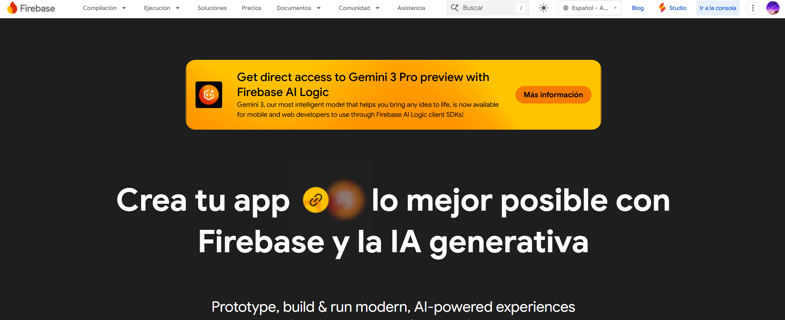

- Se implementan los comandos de instalacion del firebase.

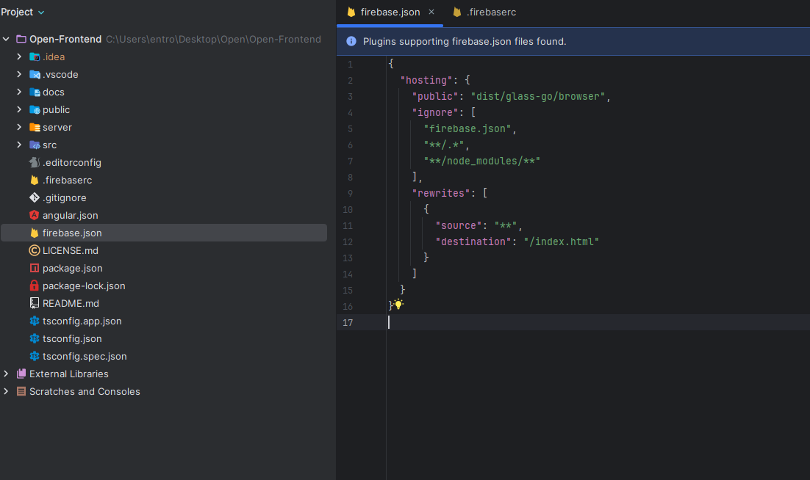

- Se configura el dominio en el que quiera alojar la aplicación web.

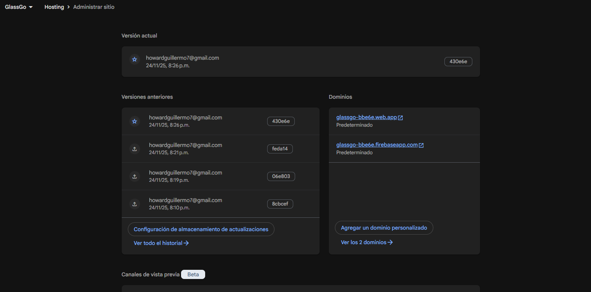

**Entornos diferenciados:**

* Desarrollo: Angular se ejecuta localmente (ng serve) apuntando a un entorno de backend local o staging.
* Producción: El entorno de producción utiliza las variables configuradas en Firebase, que apuntan al backend desplegado en Render.

**Integración con backend:**
El frontend se comunica con el backend a través de HTTP consumiendo la API REST pública expuesta desde Render. Se realiza control de errores y carga de recursos asincrónicos desde los endpoints definidos.

**3. Backend Web Services – Java Spring Boot**

**Tecnología Base**

* Framework: Spring Boot
* Lenguaje: Java 21
* Build Tool: Maven
* Contenedorización: Docker
* Base de datos: MySQL
* Hosting: Render

**Configuración y Despliegue**

- Se introduce el link del repositorio y se escoge la branch en render.

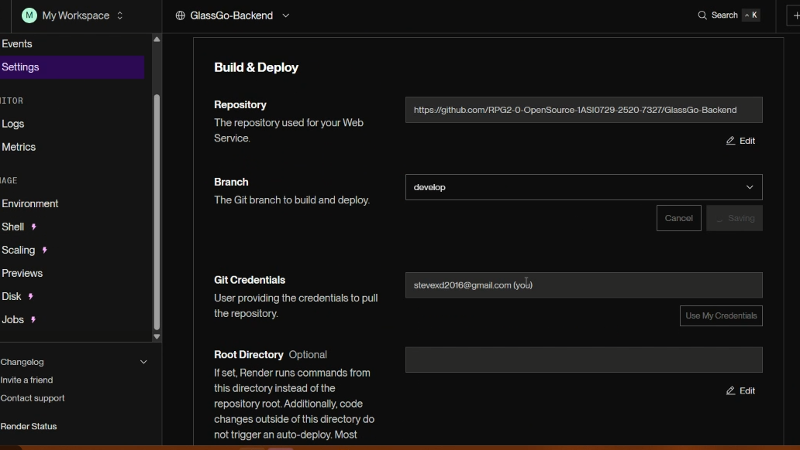

- Se configura el entorno de producción con las variables necesarias para la conexión a la base de datos y otros parámetros críticos en filess.io

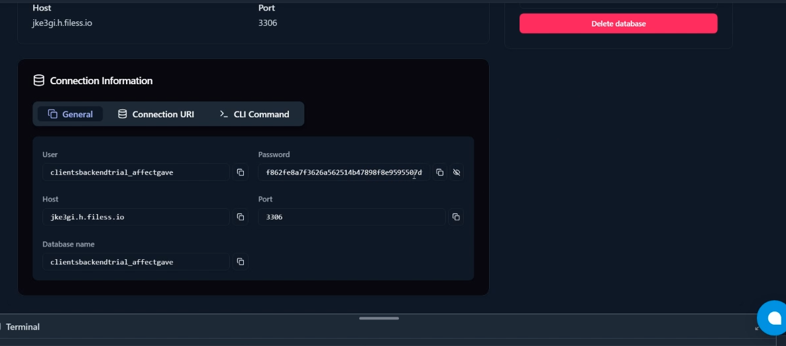

- Se introduce los keys y values de las variables de entorno necesarias para la correcta ejecución del servicio.

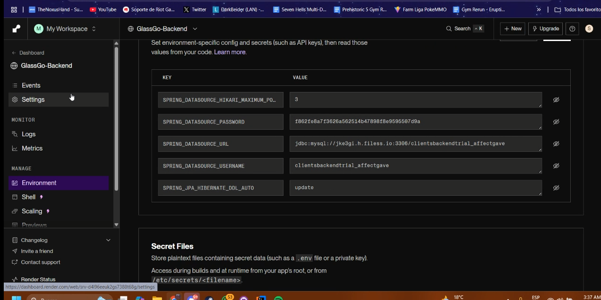

- Render detecta automáticamente el proyecto como una aplicación de Spring Boot y configura el build y run commands por defecto.

## 5.2. Landing Page, Services & Applications Implementation.

### 5.2.1. Sprint 1

El primer sprint es un hito importante en nuestro proceso de desarrollo ágil. Durante este período, nos enfocamos en la implementación de las características y funcionalidades prioritarias identificadas en la planificación inicial. Esto implica traducir los requisitos y especificaciones en código funcional, desarrollando las bases de nuestro producto de manera iterativa.

#### 5.2.1.1. Sprint Planning 1\.

El sprint planning es una reunión en la metodología ágil donde el equipo planifica las actividades del próximo sprint. Define qué trabajo se hará, cuánto tiempo tomará y quién será responsable. El objetivo es establecer un plan claro y alcanzable para el equipo, fomentando la colaboración y asegurando que todos estén alineados en cuanto a objetivos y prioridades.

| Sprint \# | Sprint 1 |
| ----- | ----- |
| **Sprint Planning Background** |  |
| **Date** | 15-09-2025 |
| **Time** | 2:00 PM |
| **Location** | Discord (Reunión virtual) |
| **Prepared By** | David Ignacio Vivar Cesar |
| **Attendees (to planning meeting)** | Mike Dylan Guillen Giraldo / Guillermo Arturo Howard Robles /  David Ignacio Vivar Cesar |
| **Sprint 1 \- 1 Review Summary** | Se inicia el proyecto con un enfoque en establecer los fundamentos de la aplicación de trazabilidad de licores. El equipo está comprometido con entregar una base sólida que incluya la landing page funcional y la documentación inicial del proyecto. Se estableció la estructura del repositorio y las primeras definiciones de la arquitectura del sistema. |
| **Sprint 1 \- 1 Retrospective Summary** | Como es el primer sprint del proyecto, no hay retrospectiva previa. El equipo estableció las primeras normas de trabajo colaborativo, decidió utilizar metodologías ágiles con reuniones diarias cortas, y definió los canales de comunicación principal a través de Discord y WhatsApp para coordinación rápida. |
| **Sprint 1 Goal** | Nuestro enfoque está en establecer una presencia web profesional y crear los fundamentos técnicos del proyecto de trazabilidad de licores. Creemos que esto entrega confianza inicial y validación del concepto a nuestros segmentos objetivo (operadores de transporte, distribuidores y administradores de tiendas). Esto será confirmado cuando tengamos una landing page funcional desplegada que presente claramente la propuesta de valor y los visitantes puedan entender el beneficio de la solución en menos de 30 segundos. |
| **Sprint 1 Velocity** | Para este sprint se estableció una velocidad de 25 Story Points, considerando que es el primer sprint y el equipo está en proceso de adaptación a la metodología de trabajo. |
| **Sum of Story Points** | La suma total de Story Points para los User Stories incluidos en este Sprint 1 es de 23 Story Points. |

#### 5.2.1.2. Aspect Leaders and Collaborators.

| Team Member (Last Name, First Name) | GitHub Username | Aspect Name 1: Desarrollo de las user stories Leader (L) / Collaborator (C) | Aspect Name 2: Desarrollo de las entrevistas Leader (L) / Collaborator (C) | Aspect Name 3: Desarrollo de los mockups Leader (L) / Collaborator (C) | Aspect Name 4: Desarrollo del landing page Leader (L) / Collaborator (C) | Aspect Name 5: Desarrollo de el capitulo 1 y 2 Leader (L) / Collaborator (C) |
| ----- | ----- | ----- | ----- | ----- | ----- | ----- |
| Guillen Giraldo, Mike Dylan | FulLHous | C | C | L | C | C |
| Howard Robles, Guillermo Arturo | Guillermo Howard | C | C | C | C | L |
| Vivar Cesar, David Ignacio | DarkBeider20 | C | C | C | C | C |

#### 5.2.1.3. Sprint Backlog 1\.

El objetivo principal de este Sprint es diseñar, implementar y validar las secciones del landing page, asegurando una navegación fluida, una experiencia responsiva en todos los dispositivos y funcionalidades críticas como registro, inicio de sesión y recuperación de contraseña. Se busca garantizar que el usuario final pueda interactuar de manera sencilla y eficiente con la plataforma, mejorando su satisfacción y promoviendo el cumplimiento de los objetivos de negocio.

| User Story |  | Work-Item / Task |  |  |  | Status |
| ----- | ----- | ----- | ----- | ----- | ----- | ----- |
| Id | Title | Id | Title | Description | Estimation (Hours) | Assigned To |
| **US-33** | Notificación de pedido en camino | W001 | Diseño de mockup landing page | Crear wireframes y diseño visual de la landing page | 8 | Guillermo Howard |
|  |  | W002 | Estructura HTML landing page | Implementar estructura HTML semántica | 6 | Ever Carlos |
|  |  | W003 | Estilos CSS responsivos | Implementar CSS responsivo para todos los dispositivos | 8 | Mike Guillen |
|  |  | W004 | Integración de formulario contacto | Implementar formulario de contacto funcional | 4 | David Vivar |
| **US-45** | Suscripción a un plan de servicio | W005 | Sección planes de suscripción | Crear sección visual de planes en landing page | 6 | Guillermo Howard |
|  |  | W006 | Validación de formularios | Implementar validación JavaScript para formularios | 4 | Gerardo Palacín |
| **US-51** | Ofrecimiento de pruebas gratuitas | W007 | Call-to-action prueba gratuita | Diseñar e implementar botones CTA para prueba gratuita | 3 | Ever Carlos |
|  |  | W008 | Configuración repositorio GitHub | Configurar estructura de carpetas y configuraciones iniciales | 4 | Abraam Acosta |
| **Config** | Configuración inicial del proyecto | W009 | Documentación README | Crear documentación inicial del proyecto en [README.md](http://readme.md/) | 6 | Mike Guillen |
|  |  | W010 | Configuración de entorno desarrollo | Configurar herramientas de desarrollo y dependencias | 5 | Abraam Acosta |
|  |  | W011 | Testing y validación | Realizar testing de funcionalidades implementadas | 8 | Guillermo Howard |
|  |  | W012 | Deploy landing page | Configurar y realizar deploy de la landing page | 4 | David Vivar |

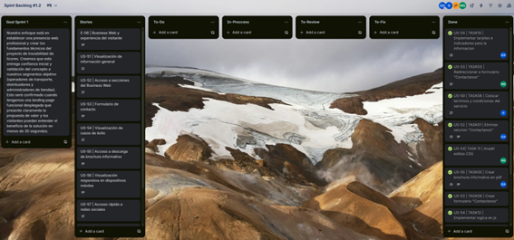

Trello: [https://trello.com/invite/b/69000cbed483a3105c16729b/ATTI81534ff0e672447d844a6ba84f132b73818B03A8/spint-backlog-12](https://trello.com/invite/b/69000cbed483a3105c16729b/ATTI81534ff0e672447d844a6ba84f132b73818B03A8/spint-backlog-12)

#### 5.2.1.4. Development Evidence for Sprint Review.

Durante el Sprint 1, el equipo se enfocó exclusivamente en el desarrollo de la Landing Page de la plataforma GlassGo. El objetivo principal fue construir una página pública funcional, atractiva visualmente y completamente responsiva, que comunique eficazmente la propuesta de valor de la plataforma a los usuarios potenciales. A lo largo del Sprint se diseñaron e implementaron secciones clave como Hero, Sobre Nosotros, Beneficios, Testimonios, Preguntas Frecuentes, Tutoriales, Contacto y el Footer. También se trabajó en asegurar la adaptabilidad móvil, el cumplimiento de criterios de accesibilidad y la optimización inicial para motores de búsqueda (SEO).

Landing Page  
Durante el Sprint 1 se implementó la Landing Page de GlassGo. Los principales avances fueron:

Diseño responsivo para diferentes tamaños de pantalla.  
Creación de secciones: Hero, Sobre Nosotros, Beneficios, Testimonios, Preguntas Frecuentes, Tutorial, Contacto y Footer.  
Aplicación de buenas prácticas de accesibilidad (etiquetado semántico, contraste adecuado).  
Optimización inicial para motores de búsqueda (SEO básico).  
Implementación de navegación fluida entre secciones.  
Validación de compatibilidad en navegadores y dispositivos.

5.2.1.5. Execution Evidence for Sprint Review.

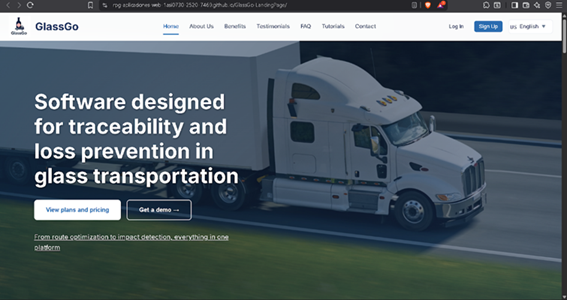

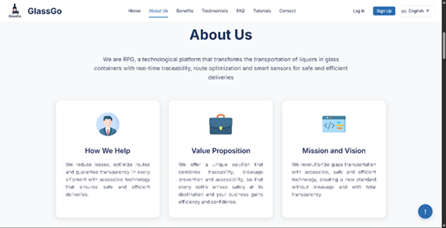

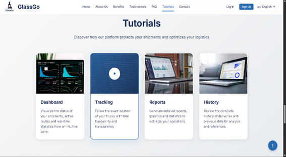

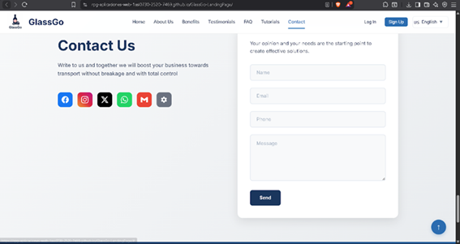

#### 5.2.1.6. Services Documentation Evidence for Sprint Review.

Durante este sprint se completó el diseño e implementación del Landing Page del sistema, el cual forma parte del acceso inicial al sistema y constituye un punto de entrada fundamental para los usuarios. Aunque no se implementaron endpoints tradicionales de tipo REST en este sprint, se documenta a continuación la URL del recurso publicado, junto con evidencia de despliegue, interacción y commits relacionados.

| Recurso | Acción implementada | Método HTTP | URL / Endpoint | Link de repositorio |
| ----- | ----- | ----- | ----- | ----- |
| Business-Web-page | Visualizaciòn inicial | GET | https://rpg2-0-opensource-1asi0729-2520-7327.github.io/GlassGo-Business-Web-page/ | [https://github.com/RPG2-0-OpenSource-1ASI0729-2520-7327/GlassGo-Business-Web-page](https://github.com/RPG2-0-OpenSource-1ASI0729-2520-7327/GlassGo-Business-Web-page)  |

| Repository | Branch | Author | Commit Id | Commit Message |
| ----- | ----- | ----- | ----- | ----- |
| feature/correction | developer | GuillermoPromac | b34ed99 | feat: add i18n system, translations, images, and main scripts |
| feature/correction | developer | FulLHous | 91e3b5e | feat: add styles for development team and about team sections. |
| feature/correction | developer | FulLHous | a2ae400 | feat: add development team and about team sections. |
| feature/correction | developer | FulLHous | 0626ddf | feat: add terms and conditions modal functionality.  |
| feature/correction | developer | FulLHous | 0d60228 | feat: add initial terms modal with accept/decline flow. |
| feature/correction | developer | FulLHous | 7bc596a | refactor: contact section into modal and update footer. |
| feature/correction | developer | FulLHous | d7b439b | feat: add legal section to footer translations. |
| feature/correction | developer | FulLHous | 4ccd329 | fix: enhance i18n system initialization and styling. |

#### 5.2.1.7. Software Deployment Evidence for Sprint Review.

xxxx

#### 5.2.1.8. Team Collaboration Insights during Sprint.

Desarrollo de las Actividades de Implementación  
Durante el Sprint 1, el equipo de GlassGo se enfocó en el desarrollo de la Landing Page. Las actividades de implementación se llevaron a cabo de la siguiente manera:

Se crearon ramas específicas para cada sección o funcionalidad (feature/\[nombre-de-seccion\]), permitiendo un trabajo paralelo organizado.  
Cada miembro del equipo asumió la responsabilidad de desarrollar una o más secciones de la Landing Page.  
Se realizaron commits frecuentes, registrando avances de manera continua y detallada.  
Las funcionalidades desarrolladas se integraron mediante Pull Requests hacia la rama develop.  
Se mantuvo una comunicación constante mediante la plataforma Discord para coordinar avances y resolver dudas en tiempo real.  
Se aplicaron buenas prácticas de programación, control de versiones y colaboración en equipo.  
Gracias a esta organización, se logró cumplir de manera efectiva el objetivo del sprint, garantizando que todos los integrantes contribuyeran de forma activa en el desarrollo de la Landing Page.

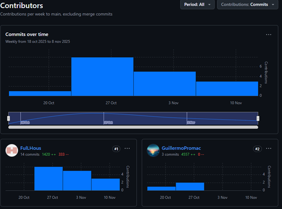

### 5.2.2. Sprint 2

#### 5.2.2.1. Sprint Planning 2\.

| Sprint \# | Sprint 2 |
| ----- | ----- |
| Sprint Planning Background |  |
| Date | 2025-11-13 |
| Time | 07:00 pm (GMT-5) |
| Location | Modalidad remota mediante la plataforma Discord |
| Prepared By | Howard Robles, Guillermo Arturo |
| Attendees (to planning meeting) |  |
| Sprint 1 Review Summary | Durante el Sprint 1 se logró implementar casi en su totalidad la Landing Page del sistema GlassGo, desarrollando secciones clave como el header, footer, sección de beneficios y preguntas frecuentes, así como la integración inicial de estilos globales y tipografía. Quedó faltante la funcionalidad de cambio de idioma, la cual será prioridad para el siguiente sprint. El equipo cumplió con los entregables establecidos, respetando el diseño de mockups y la guía de estilos. Se identificaron oportunidades de mejora en la velocidad de desarrollo y gestión de tiempos. |
| Sprint 1 Retrospective Summary | Durante el Sprint 1, el equipo logró avanzar de forma coordinada y efectiva en el desarrollo de la landing page, sin enfrentar mayores dificultades. Cada integrante cumplió puntualmente con las secciones asignadas, lo que permitió avanzar según lo planificado. La adopción de convenciones comunes en el código y el diseño contribuyó a mantener la coherencia del producto y facilitó la integración entre partes. Como mejora para el siguiente sprint, se acordó implementar revisiones diarias (daily reviews) que permitan alinear mejor los avances, detectar bloqueos tempranos y mejorar la comunicación continua entre miembros. |
| Sprint Goal & User Stories |  |
| Sprint 2 Goal | Nuestro enfoque está en brindar información clara y detallada a los visitantes de la plataforma, así como habilitar la gestión de inventario, configuración de perfil, notificaciones, resumen de datos y gestión deventas para los usuarios del sistema interno. Creemos que esto proporciona mayor comprensión del propósito de la solución a los visitantes y mejora la eficiencia operativa de insumos de los administradores de restaurantes y proveedores. Esto se confirmará cuando los visitantes puedan explorar contenido relevante desde el acceso público, y los usuarios autenticados naveguen por el panel principal y accedan a los módulos de gestión de inventario, configuración de perfil, notificaciones, resumen de datos y ventas del sistema. |
| Sprint 2 Velocity | 45 |
| Sum of Story Points | 42 |

#### 5.2.2.2. Aspect Leaders and Collaborators.

Aspect Leaders and Collaborators  
Durante el Sprint 2, se ha definido el desarrollo e integración de los módulos principales del frontend de la aplicación web interna GlassGo , abarcando funcionalidades clave como la gestión de productos, pedidos, inventario y compras. Estas implementaciones buscan optimizar los procesos internos y mejorar la trazabilidad del inventario, brindando mayor eficiencia a los administradores de restaurantes y su personal.

Con el fin de mantener una coordinación efectiva y una comunicación fluida entre los integrantes del equipo, se estructuró la matriz de liderazgo y colaboración (LACX), donde se asignó un líder (L) encargado de cada funcionalidad y colaboradores (C) que brindan apoyo en su implementación.

| Team Member (Last Name, First Name) | GitHub Username | Profile & References  | Paymets & Subscriptions  | Loyalty & Engagerment  | Service Planning  | System Administration  | Service Execution & Monitoring | Dashboard & Analytics |
| ----- | ----- | :---- | :---- | :---- | :---- | :---- | :---- | :---- |
| Howard Robles Guillermo Arturo | GuillermoPromac | C | C | C | C | C | L | L |
| Cespedes Pillco Jarod Jack | PruebaJJC | C | L | C | C | C | C | C |
| Vivar Cesar David Ignacio | DarkBeider20 | C | C | L | C | L | C | C |
| Guillen Giraldo Mike Dylan | FulLHous | L | C | C | L | C | C | C |

#### 5.2.2.3. Sprint Backlog 2\.

El objetivo principal de este Sprint es desarrollar la interfaz frontend, enfocándose en una estructura clara, navegación eficiente y visualización adecuada de datos críticos.

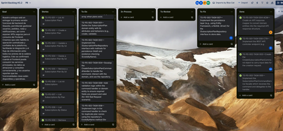

Trello: [https://trello.com/invite/b/69000cde1e1959306e4d45ba/ATTIeabfa518f63107c177ee788bf4c455a21CE02ADD/sprint-backlog-22](https://trello.com/invite/b/69000cde1e1959306e4d45ba/ATTIeabfa518f63107c177ee788bf4c455a21CE02ADD/sprint-backlog-22)

#### 5.2.2.4. Development Evidence for Sprint Review.

En esta sección se presentan los avances realizados durante el Sprint 2, centrado en el desarrollo de los módulos principales de la aplicación web interna de GlassGo. El objetivo principal fue implementar funcionalidades claves para la gestión de productos, inventario y resumen, con el fin de mejorar la eficiencia operativa y la trazabilidad de los recursos dentro de los administradores de restaurantes y proveedores.

#### 5.2.2.5. Execution Evidence for Sprint Review.

A continuación se muestra el video del frontend interno de la aplicación web. Este muestra la interacción de los usuarios autenticados con los módulos principales del sistema, incluyendo la navegación por la barra lateral, la gestión de productos, el seguimiento de alertas y el control de inventario.

#### 5.2.2.6. Services Documentation Evidence for Sprint Review.

Durante este Sprint, se avanzó en el desarrollo del frontend interno de GlassGo, que permite múltiples rutas navegables para usuarios autenticados (administradores de restaurantes y proveedores), en una estructura basada en Vue Router, Diseño Orientado al Dominio y componentes de carga dinámica. Si bien los endpoints REST aún no se han documentado con OpenAPI, los recursos navegables disponibles que forman parte del ecosistema de consumo de servicios web del sistema se despliegan a continuación.

Descripción del Logro:

Finalización de la página de destino e implementación multilingüe.

Desarrollo de un frontend modular con rutas específicas por rol (restaurante y proveedor).
Estructura basada en Vue Router, DDD y carga diferida de componentes.
Integración visual con PrimeVue y mejores prácticas para la separación por contextos. Rutas del sistema accesibles (Frontend)

#### 5.2.2.7. Software Deployment Evidence for Sprint Review.

Durante este sprint, se realizaron actividades de despliegue y pruebas de los servicios desarrollados, asegurando que las funcionalidades del sistema estén operativas y accesibles para los usuarios finales. A continuación, se detallan los pasos realizados:

#### 5.2.2.8. Team Collaboration Insights during Sprint.

Durante el sprint, se adoptaron estrategias de colaboración eficaces que permitieron un desarrollo del proyecto fluido y bien organizado. Las prácticas aplicadas fueron las siguientes:

Se crearon ramas específicas por funcionalidad o sección, siguiendo la convención feature/\[nombre-de-la-sección\]. Esto facilitó el trabajo en paralelo sin conflictos y mantuvo la estructura del repositorio.

Cada miembro fue responsable del desarrollo de una o más secciones del frontend, distribuyendo el trabajo de forma equitativa.
Se realizaron commits frecuentes y atómicos, lo que permitió un seguimiento detallado del progreso y facilitó la revisión del código.

Todas las funcionalidades se integraron mediante solicitudes de incorporación de cambios a la rama de desarrollo, lo que garantizó el control de calidad mediante revisiones cruzadas.

La comunicación entre los miembros del equipo fue constante, utilizando la plataforma Discord como canal principal para la coordinación diaria, la resolución de dudas y la toma de decisiones técnicas. Se aplicaron buenas prácticas de control de versiones con Git, como descripciones claras de las confirmaciones, ramas temáticas y revisión colaborativa mediante solicitudes de cambio.
El equipo también se centró en la calidad del código, utilizando estructuras consistentes, siguiendo los estándares de codificación y garantizando la coherencia de estilos y convenciones.

### 5.2.3. Sprint 3

#### 5.2.3.1. Sprint Planning 3\.

| Sprint \# | Sprint 2 |
| ----- | ----- |
| Sprint Planning Background |  |
| Date | 2025-11-13 |
| Time | 08:00 pm (GMT-5) |
| Location | Modalidad remota mediante la plataforma Discord |
| Prepared By | Howard Robles, Guillermo Arturo |
| Attendees (to planning meeting) |  |
| Sprint 2 Review Summary |  |
| Sprint 2 Retrospective Summary | Durante el Sprint 1, el equipo logró avanzar de forma coordinada y efectiva en el desarrollo de la landing page, sin enfrentar mayores dificultades. Cada integrante cumplió puntualmente con las secciones asignadas, lo que permitió avanzar según lo planificado. La adopción de convenciones comunes en el código y el diseño contribuyó a mantener la coherencia del producto y facilitó la integración entre partes. Como mejora para el siguiente sprint, se acordó implementar revisiones diarias (daily reviews) que permitan alinear mejor los avances, detectar bloqueos tempranos y mejorar la comunicación continua entre miembros. |
| Sprint Goal & User Stories |  |
| Sprint 3 Goal | Nuestro enfoque está en entregar la primera versión funcional del backend de GlassGo, permitiendo gestionar usuarios, pedidos, rutas y notificaciones, así como exponer APIs seguras para el consumo del frontend. Creemos que esto habilita la operación centralizada y confiable de la plataforma, facilitando la integración y el flujo de información entre todos los actores de la cadena logística. Esto se confirmará cuando el frontend pueda consumir los servicios principales, los datos se almacenen y consulten correctamente, y los usuarios reporten que las funcionalidades clave están disponibles y operativas. |
| Sprint 3 Velocity | 50 |
| Sum of Story Points | 47 |

#### 5.2.3.2. Aspect Leaders and Collaborators.

Durante el Sprint 3, se ha definido el desarrollo e integración de los módulos principales del frontend de la aplicación web interna Restock y del backend, abarcando funcionalidades clave como la gestión de productos, pedidos, inventario y compras. Estas implementaciones buscan optimizar los procesos internos y mejorar la trazabilidad del inventario, brindando mayor eficiencia a los repartidores y dueños de negocios.

| Team Member (Last Name, First Name) | GitHub Username | Profile & References  | Paymets & Subscriptions  | Loyalty & Engagerment  | Service Planning  | System Administration  | Service Execution & Monitoring | Dashboard & Analytics |
| ----- | ----- | :---- | :---- | :---- | :---- | :---- | :---- | :---- |
| Howard Robles Guillermo Arturo | GuillermoPromac | C | C | C | C | C | L | L |
| Cespedes Pillco Jarod Jack | PruebaJJC | C | L | C | C | C | C | C |
| Vivar Cesar David Ignacio | DarkBeider20 | C | C | L | C | L | C | C |
| Guillen Giraldo Mike Dylan | FulLHous | L | C | C | L | C | C | C |

#### 5.2.3.3. Sprint Backlog 3\.

El objetivo principal de este Sprint es consolidar una experiencia funcional completa para los distintos perfiles de usuario dentro de la plataforma GlassGo. Se prioriza la mejora de la landing page para comunicar eficazmente la propuesta de valor a nuevos visitantes, así como la habilitación de módulos clave como la gestión de ventas, recetas y pedidos para los administradores de restaurantes, y la gestión de órdenes para los proveedores.

Trello: [https://trello.com/invite/b/69000c76fa893622d701697c/ATTI60bf0022730e8c5c23ff3f754d43e9b185AF029B/sprint-backlog-32](https://trello.com/invite/b/69000c76fa893622d701697c/ATTI60bf0022730e8c5c23ff3f754d43e9b185AF029B/sprint-backlog-32) 

#### 5.2.3.4. Development Evidence for Sprint Review.

Web Services (Backend):

| Repository | Branch | Author | Commit Id | Commit Message |
| ----- | ----- | ----- | ----- | ----- |
| feature/service-planning | developer | PruebaJJC | 4e6e88e | feat(shared): add auditable abstract aggregate root base class. |
| feature/service-planning | developer | PruebaJJC | c218bfb | feat(shared): introduce auditable base model for entity tracking. |
| feature/service-planning | developer | PruebaJJC | 4d68641 | feat(naming-convention): implement custom physical naming strategy with snake case and pluralized table names. |
| feature/service-planning | developer | PruebaJJC | a3e8e7b | feat(api): add message resource record to represent message payloads. |
| feature/service-planning | developer | PruebaJJC | c99c5fb | feat(api): add global exception handler for rest api error handling. |
| feature/service-planning | developer | PruebaJJC | 356d14e | feat(open-api-docs): add open-api configuration for api documentation setup. |
| feature/service-planning | developer | PruebaJJC | f54047a | feat(shared): merge shared bounded context.  |
| feature/service-planning | developer | PruebaJJC | 5ff5bf3 | feat(domain): add assignment aggregate for service planning. |
|  |  |  |  |  |

#### 5.2.3.5. Execution Evidence for Sprint Review.

A continuación, se muestra un video con los avances realizados durante el Sprint 3, en el cual se trabajó en la landing page, así como en el desarrollo del frontend y backend.

https://youtu.be/fgSdkh02vZo

#### 5.2.3.6. Services Documentation Evidence for Sprint Review.

Durante este sprint se completó al 100% el desarrollo del Landing Page del sistema, consolidando su estructura visual, diseño responsivo, traducción multilenguaje y funcionalidades de navegación. Asimismo, se avanzó de forma significativa en la construcción del frontend del sistema, incluyendo componentes claves como el menú lateral, el dashboard inicial, el módulo de gestión de insumos y la arquitectura modular en Angular bajo DDD (Domain-Driven Design).

Aunque no se desplegaron endpoints REST aún, se documentan a continuación los recursos y avances relevantes del sprint, junto con evidencia de despliegue y repositorio de código.

Descripción del Logro:

Finalización del Landing Page (100%).  
Implementación completa de diseño responsivo, i18n, y redirecciones funcionales.  
Estructura de frontend modular iniciada (menu sidebar, dashboard y componentes base).  
Aplicación de buenas prácticas de organización por bounded contexts en Angular.  
Integración visual basada en Vue con VuePrime y Primeflex.

#### 5.2.3.7. Software Deployment Evidence for Sprint Review.

Durante este sprint, se realizaron actividades de despliegue y pruebas de los servicios desarrollados, asegurando que las funcionalidades del sistema estén operativas y accesibles para los usuarios finales. A continuación, se detallan los pasos realizados:

#### 5.2.3.8. Team Collaboration Insights during Sprint.

Seguimos usando ramas específicas para cada sección o funcionalidad (feature/\[nombre-de-seccion\]), permitiendo un trabajo paralelo organizado.

Cada miembro del equipo asumió la responsabilidad de desarrollar una o más boundeds del Backend. Se realizaron commits frecuentes, registrando avances de manera continua y detallada.

### 5.2.4. Sprint 4

#### 5.2.4.1. Sprint Planning 4\.

| Sprint \#                       | Sprint 3                                                                                                                                                                                                                                                                                                                                                                                                                                                                                                                                                                                                                                                                                                                                                                                                                    |
|---------------------------------|-----------------------------------------------------------------------------------------------------------------------------------------------------------------------------------------------------------------------------------------------------------------------------------------------------------------------------------------------------------------------------------------------------------------------------------------------------------------------------------------------------------------------------------------------------------------------------------------------------------------------------------------------------------------------------------------------------------------------------------------------------------------------------------------------------------------------------|
| Sprint Planning Background      |                                                                                                                                                                                                                                                                                                                                                                                                                                                                                                                                                                                                                                                                                                                                                                                                                             |
| Date                            | 2025-11-29                                                                                                                                                                                                                                                                                                                                                                                                                                                                                                                                                                                                                                                                                                                                                                                                                  |
| Time                            | 06:00 pm (GMT-5)                                                                                                                                                                                                                                                                                                                                                                                                                                                                                                                                                                                                                                                                                                                                                                                                            |
| Location                        | Modalidad remota mediante la plataforma Discord                                                                                                                                                                                                                                                                                                                                                                                                                                                                                                                                                                                                                                                                                                                                                                             |
| Prepared By                     | Howard Robles, Guillermo Arturo                                                                                                                                                                                                                                                                                                                                                                                                                                                                                                                                                                                                                                                                                                                                                                                             |
| Attendees (to planning meeting) | .Guillermo Arturo Howard Robles / Jarod Cespedes / David Vivar Cesar / Myke Guillen Giraldo                                                                                                                                                                                                                                                                                                                                                                                                                                                                                                                                                                                                                                                                                                                                 |
| Sprint 3 Review Summary         | Durante el Sprint 3 se logró integrar las funcionalidades esenciales para la gestión de pedidos y ventas de licores, así como la visualización de los pedidos y perfil. Se implementaron flujos completos en frontend y backend para los administradores de dueños de neogios y proveedores. El equipo demostró gran compromiso y coordinación, permitiendo avances notables en la implementación de casos de uso claves. Sin embargo, se identificaron oportunidades de mejora en la automatización de pruebas y en la gestión de errores complejos.                                                                                                                                                                                                                                                                       |
| Sprint 3 Retrospective Summary  | El equipo mantuvo una comunicación activa y resolvió bloqueos técnicos con rapidez, destacando el soporte mutuo entre miembros. Se identificó que algunos endpoints requerían mejoras en validación y documentación, lo que motivó a priorizar en este nuevo sprint las tareas técnicas orientadas a robustecer los servicios RESTful, implementar nuevas funcionalidades de cuenta (generación de tablas, eliminación, cambio de contraseña) y finalizar la lógica de notificaciones y feedback. Como mejora clave se acordó dividir mejor las tareas de testing y codificación para asegurar calidad sin comprometer la velocidad de entrega.                                                                                                                                                                             |
| Sprint Goal & User Stories      |                                                                                                                                                                                                                                                                                                                                                                                                                                                                                                                                                                                                                                                                                                                                                                                                                             |
| Sprint 4 Goal                   | Nuestro enfoque está en mejorar la experiencia de los dueños de negocios y proveedores de licores, mediante la implementación completa de funcionalidades clave del perfil, además de finalizar flujos críticos como la gestión de ventas y la gestión de insumos. En paralelo, proporcionar, mediante el API de la plataforma, puntos de accesos a los desarrolladores frontend para que implementen funcionalidades relacionadas con perfiles, gestión de insumos, inicio de sesión y registro validados. Creemos que esto ofrece un flujo de usuario más seguro, al proteger el ingreso de a la plataforma; agiliza las operaciones para los dueños de negocio, al facilitar la creación y gestión de insumos; optimiza el tiempo operativo para los proveedores, al permitir el seguimiento de sus insumos disponibles. |
| Sprint 4 Velocity               | 48                                                                                                                                                                                                                                                                                                                                                                                                                                                                                                                                                                                                                                                                                                                                                                                                                          |
| Sum of Story Points             | 46                                                                                                                                                                                                                                                                                                                                                                                                                                                                                                                                                                                                                                                                                                                                                                                                                          |

#### 5.2.4.2. Aspect Leaders and Collaborators.

Durante el Sprint 4, se ha definido el desarrollo e integración de los módulos principales del frontend de la aplicación web interna Restock y del backend, abarcando funcionalidades clave como la gestión de productos, pedidos, inventario y compras. Estas implementaciones buscan optimizar los procesos internos y mejorar la trazabilidad del inventario, brindando mayor eficiencia a los repartidores y dueños de negocios.

| Team Member (Last Name, First Name) | GitHub Username | Profile & References  | Paymets & Subscriptions  | Loyalty & Engagerment  | Service Planning  | System Administration  | Service Execution & Monitoring | Dashboard & Analytics |
| ----- | ----- | :---- | :---- | :---- | :---- | :---- | :---- | :---- |
| Howard Robles Guillermo Arturo | GuillermoPromac | C | C | C | C | C | L | L |
| Cespedes Pillco Jarod Jack | PruebaJJC | C | L | C | C | C | C | C |
| Vivar Cesar David Ignacio | DarkBeider20 | C | C | L | C | L | C | C |
| Guillen Giraldo Mike Dylan | FulLHous | L | C | C | L | C | C | C |

#### 5.2.4.3. Sprint Backlog 4\.

El objetivo principal de este Sprint es consolidar una experiencia funcional completa para los distintos perfiles de usuario dentro de la plataforma GlassGo. Se prioriza la mejora de la landing page para comunicar eficazmente la propuesta de valor a nuevos visitantes, así como la habilitación de módulos clave como la gestión de ventas, recetas y pedidos para los administradores de restaurantes, y la gestión de órdenes para los proveedores.

Asimismo, se trabajará en la integración del flujo de pagos por suscripción y en la provisión de APIs REST documentadas, permitiendo al equipo frontend consumir endpoints de forma eficiente para construir las vistas requeridas. Este enfoque integral busca mejorar la usabilidad, operatividad y cohesión entre el frontend y backend, facilitando la validación funcional de la plataforma y avanzando hacia su adopción por parte de los usuarios finales.

Trello: [https://trello.com/invite/b/68ffe30942dcb480aedf84d2/ATTI14ff021bc259e9ac94812c42ae4680e22318D9BD/sprint-backlog-3](https://trello.com/invite/b/68ffe30942dcb480aedf84d2/ATTI14ff021bc259e9ac94812c42ae4680e22318D9BD/sprint-backlog-3)

#### 5.2.4.4. Development Evidence for Sprint Review.

**Business-Web-Page**

- Se creo el Business Web Page para la demostrancion de la mision, vision y la propuesta de valor del proyecto final GlassGo, ademas del equipo de desarrollo con el video About-the-Team y informacion de nuestro proyecto reflejado en el video About-the-Product.
- Para la creacion del Business Web Page del proyecto final, se utilizo el lenaguje html, css y javascript junto con i18n para la internacionalizacion del sitio web, se utilizo la plataforma de GitHub Pages, para alojar el sitio web directamente desde el repositorio del proyecto, facilitando la presentación y acceso al informe final.

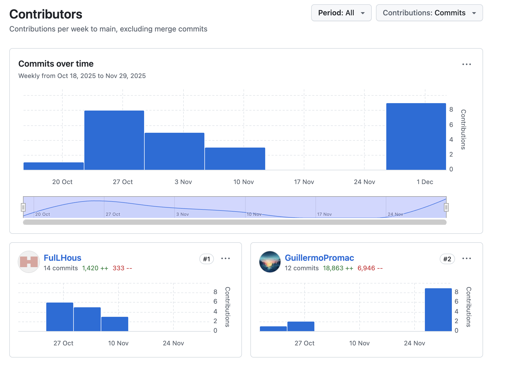

Web Services (Backend):

En el backend de la plataforma se realizaron importantes avances enfocados en la gestión de pedios, suministros y lotes. Se implementaron un manejo detallado para los insumos, además de validar y reforzar la integridad de datos mediante objetos de valor específicos. También se añadieron configuraciones para ambientes de desarrollo y producción, y se mejoraron las definiciones de columnas en la base de datos para optimizar el manejo de fechas, precios y cantidades. Se desarrollaron servicios y controladores que facilitan la interacción con los recursos, permitiendo una gestión eficiente y segura de los datos relacionados con el inventario y las operaciones del sistema.

#### 5.2.4.5. Execution Evidence for Sprint Review.

A continuación, se muestra un video con los avances realizados durante el Sprint 3, en el cual se trabajó en la landing page, así como en el desarrollo del frontend y backend.

https://youtu.be/fgSdkh02vZo

#### 5.2.4.6. Services Documentation Evidence for Sprint Review.

Durante este sprint se completó al 100% el desarrollo del Landing Page del sistema, consolidando su estructura visual, diseño responsivo, traducción multilenguaje y funcionalidades de navegación. Asimismo, se avanzó de forma significativa en la construcción del frontend del sistema, incluyendo componentes claves como el menú lateral, el dashboard inicial, el módulo de gestión de insumos y la arquitectura modular en Angular bajo DDD (Domain-Driven Design).

Aunque no se desplegaron endpoints REST aún, se documentan a continuación los recursos y avances relevantes del sprint, junto con evidencia de despliegue y repositorio de código.

Descripción del Logro:

Finalización del Landing Page (100%).  
Implementación completa de diseño responsivo, i18n, y redirecciones funcionales.  
Estructura de frontend modular iniciada (menu sidebar, dashboard y componentes base).  
Aplicación de buenas prácticas de organización por bounded contexts en Angular.  
Integración visual basada en Vue con VuePrime y Primeflex.

#### 5.2.4.7. Software Deployment Evidence for Sprint Review.

Web Services (Backend):

En el backend de la plataforma se realizaron importantes avances enfocados en la gestión de pedios, suministros y lotes. Se implementaron un manejo detallado para los insumos, además de validar y reforzar la integridad de datos mediante objetos de valor específicos. También se añadieron configuraciones para ambientes de desarrollo y producción, y se mejoraron las definiciones de columnas en la base de datos para optimizar el manejo de fechas, precios y cantidades. Se desarrollaron servicios y controladores que facilitan la interacción con los recursos, permitiendo una gestión eficiente y segura de los datos relacionados con el inventario y las operaciones del sistema.

#### 5.2.4.8. Team Collaboration Insights during Sprint.

Seguimos usando ramas específicas para cada sección o funcionalidad (feature/\[nombre-de-seccion\]), permitiendo un trabajo paralelo organizado.

Cada miembro del equipo asumió la responsabilidad de desarrollar una o más boundeds del Backend. Se realizaron commits frecuentes, registrando avances de manera continua y detallada. Las funcionalidades desarrolladas se integraron mediante Pull Requests hacia la rama develop. Se mantuvo una comunicación constante mediante la plataforma Discord para coordinar avances y resolver dudas en tiempo real. Se aplicaron buenas prácticas de programación, control de versiones y colaboración en equipo.

## 5.3. Validation Interviews.

### 5.3.1. Diseño de Entrevistas.

Para garantizar que la aplicación cumpla con las necesidades reales de los usuarios finales, se diseñó un proceso de entrevistas de validación centrado en dos segmentos objetivos clave: **dueños de negocio** y **proveedores de licores**. Cada sesión de validación incluirá interacción con el **Landing Page** y la **aplicación web** (desktop y mobile), siguiendo flujos de usuario específicos que cubren funcionalidades críticas del sistema.

**Objetivo General**

Validar la usabilidad, comprensión y utilidad de las funcionalidades del sistema a través de sesiones controladas de interacción, aplicando principios de evaluación heurística y recogiendo observaciones cualitativas.

**Segmento 1: Proveedores de Licores**

Elementos a validar:

- Creación de orden de compra. 
- Seguimiento de pedidos.
- Gestión de inventario de insumos.
- Creación de tablas de productos.
- Registro de historial.

Flujos de Usuario a evaluar:

- **Desktop & Mobile User Flow 1:** Registro y gestión de suministros..
- **Desktop & Mobile User Flow 4:** Resumen del producto.
- **Desktop & Mobile User Flow 5:** Visualización de pedidos.
- **Desktop & Mobile User Flow 6:** Seguimiento de pedidos.
- **Desktop & Mobile User Flow 7:** Reclamaciones a proveedores.
- 
Actividades durante la sesión:

1. Explorar el Landing Page y describir su comprensión del producto.
2. Simular el proceso de registro.
3. Ingresar al sistema y registrar productos en su catálogo.
4. Revisar pedidos recibidos.
5. Comentar sobre la utilidad de la interfaz de pedidos y feedback.

**Herramientas y Recursos para Validación**

- **Formato de Evaluación Heurística:** Se aplicarán los 10 principios heurísticos de Nielsen en cada sesión.
- **Instrumento de observación:** Lista de verificación + sección de notas abiertas.
- **Grabación de pantalla y voz:** previa autorización, para análisis posterior.

**Segmento 3: Dueños de negocio**

Elementos a validar:

- Creación de orden de compra.
- Seguimiento de pedidos.
- Gestión de inventario de insumos.
- Creación de tablas de productos.
- Registro de historial.

Flujos de Usuario a evaluar:

- **Desktop & Mobile User Flow 1:** Registro y gestión de suministros..
- **Desktop & Mobile User Flow 4:** Resumen del producto.
- **Desktop & Mobile User Flow 5:** Visualización de pedidos.
- **Desktop & Mobile User Flow 6:** Seguimiento de pedidos.
- **Desktop & Mobile User Flow 7:** Reclamaciones a proveedores.

Actividades durante la sesión:

1. Explorar el Landing Page y describir su comprensión del producto.
2. Simular el proceso de registro.
3. Ingresar al sistema y registrar productos en su catálogo.
4. Revisar pedidos recibidos.
5. Comentar sobre la utilidad de la interfaz de pedidos y feedback.

### 5.3.2. Registro de Entrevistas.

Segmento 3: Dueños de negocio

**Entrevista 1:**

* **Nombre:** Alejandro Rodriguez
* **Edad:** 37 años
* **Distrito:** Lima Metropolitana
* **Timing:** (00:00- 12:39 min)

**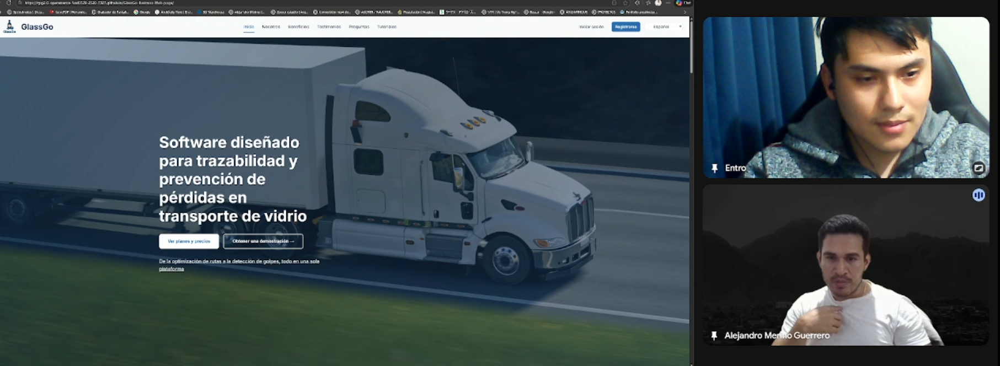**

Ver entrevista: https://tinyurl.com/3vn4bcyw

**Resumen:**

Alejandro Rodríguez, de 37 años, es propietario de un bar de tamaño mediano ubicado en Lima, con varios años de funcionamiento. Su negocio se orienta a un público joven y adulto joven. Alejandro proyecta una personalidad organizada, analítica y con interés en mantener control operativo, aunque delega parte de la gestión a su equipo. Muestra predisposición al uso de la tecnología, aunque prefiere mantener una supervisión directa de los procesos administrativos.

### 5.3.3. Evaluación según heurísticas.

**Carrera:** Ingeniería de Software
**Curso:** Desarrollo de Aplicaciones Open Source
**Sección:** 7327
**Profesores:** Angel Velasquez
**Auditor:** Guillermo Arturo Howard Robles
**Cliente(s):** Alejandro Rodriguez

**Site o App a evaluar:** GlassGo

**Tareas evaluadas:**

1. Creación de orden de compra
2. Seguimiento de pedidos
3. Gestión de inventario de insumos
4. Creación de tablas de productos
5. Registro de historial 

---

**ESCALA DE SEVERIDAD:**

Los errores serán puntuados tomando en cuenta la siguiente escala de severidad

<table>
    <tr>
        <td>Nivel</td>
        <td>Descripción</td>
    </tr>
    <tr>
        <td>1</td>
        <td>Problema superficial: puede ser fácilmente superador por el usuario ó ocurre con muy poco frecuencia. No necesita ser arreglado a no ser que exista disponibilidad de tiempo.</td>
    </tr>
    <tr>
        <td>2</td>
        <td>Problema menor: puede ocurrir un poco más frecuentemente o es un poco más difícil de superar para el usuario. Se le debería asignar una prioridad baja resolverlo de cara al siguiente reléase</td>
    </tr>
    <tr>
        <td>3</td>
        <td>Problema mayor: ocurre frecuentemente o los usuarios no son capaces de resolverlos. Es importante que sean corregidos y se les debe asignar una prioridad alta.</td>
    </tr>
    <tr>
        <td>4</td>
        <td>Problema muy grave: un error de gran impacto que impide al usuario continuar con el uso de la herramienta. Es imperativo que sea corregido antes del lanzamiento.</td>
    </tr>
</table>

---

**TABLA RESUMEN**

| #  | Problem                                                | Severity Scale | Heuristic / Principle Violated |
| -- |--------------------------------------------------------|----------------|--------------------------------|
| 1  | No existen filtros para los productos en el inventario | 3              | Usabilidad: Flexibilidad y eficiencia de uso                  |
| 2  | Flujo de creacion de reclamos mas concistente          | 3              | Usabilidad: Libertad y control del usuario                  |

---

**PROBLEM DESCRIPTION**

**PROBLEM #1: No existen filtros para los productos en el inventario**
**Severity:** 3
**Violated Heuristic:** Usabilidad - Flexibilidad y eficiencia de uso
**Problem:** Actualmente, el sistema no ofrece opciones de filtrado para los productos en el inventario, lo que dificulta la localización rápida de artículos específicos, especialmente cuando el inventario es extenso.
**Evidence:** EL usuario indicó: "Para encontrar un producto específico, tengo que desplazarme por toda la lista, lo que consume mucho tiempo y es frustrante."
**Recommendation:** Implementar funcionalidades de filtrado y búsqueda en la sección de inventario, permitiendo a los usuarios filtrar productos por categorías, nombres, fechas de ingreso, entre otros criterios relevantes. Esto mejorará significativamente la eficiencia en la gestión del inventario.

---

**PROBLEM #2: Flujo de creacion de reclamos mas consistent**
**Severity:** 3
**Violated Heuristic:** Usabilidad - Libertad y control del usuario
**Problem:** El flujo actual para la creación de reclamos no es intuitivo ni consistente, lo que genera confusión entre los usuarios y dificulta la presentación de reclamos de manera efectiva.
**Evidence:** El usuario indicó: "Para crear un reclamo de un pedido en especifico seria mejor añadir una opcion para que genere el reclamo".
**Recommendation:** Rediseñar el flujo de creación de reclamos para que sea más intuitivo y consistente. Esto podría incluir la adición de un botón directo en la sección de pedidos para iniciar un reclamo, así como proporcionar instrucciones claras y pasos guiados durante el proceso.

---

## 5.4. Video About-the-Product.

A continuación, se presenta el video "About the Product" del sistema GlassGo, una solución tecnológica desarrollada para digitalizar y automatizar la gestión de inventarios y pedidos de bares. Este video está dirigido principalmente a los visitantes del Landing Page, quienes desean conocer el modelo de negocio y las principales funcionalidades de la plataforma, así como a los usuarios potenciales de las aplicaciones, interesados en realizar tareas relacionadas con los procesos soportados por la solución.

El video comunica de forma clara y dinámica el propósito del producto, mostrando cómo GlassGo ayuda a reducir el desperdicio, mejorar la eficiencia operativa y fortalecer la relación entre dueños de negocios y proveedores de licores. Se utiliza un tono consistente con la propuesta visual y comunicacional del producto, combinando narración, demostraciones de uso y escenarios reales.

Como parte de la validación del producto, se incluye también el testimonio de un dueño de negocio entrevistado en la etapa de descubrimiento.

A continuación, se incluye un screenshot del video, junto con los enlaces de la versión publicada en Microsoft Stream y YouTube.

https://youtu.be/fgSdkh02vZo

https://tinyurl.com/2nj6czbv