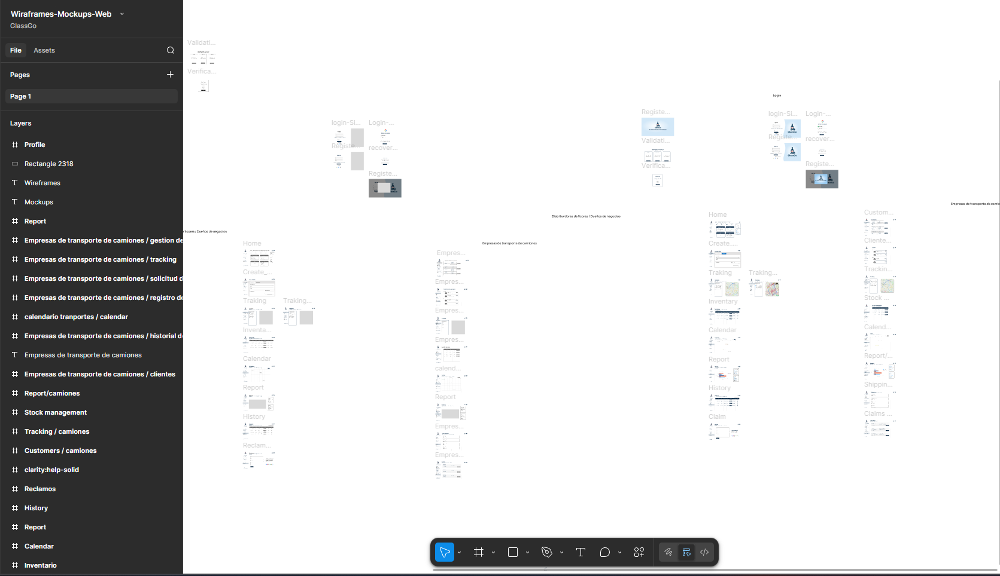
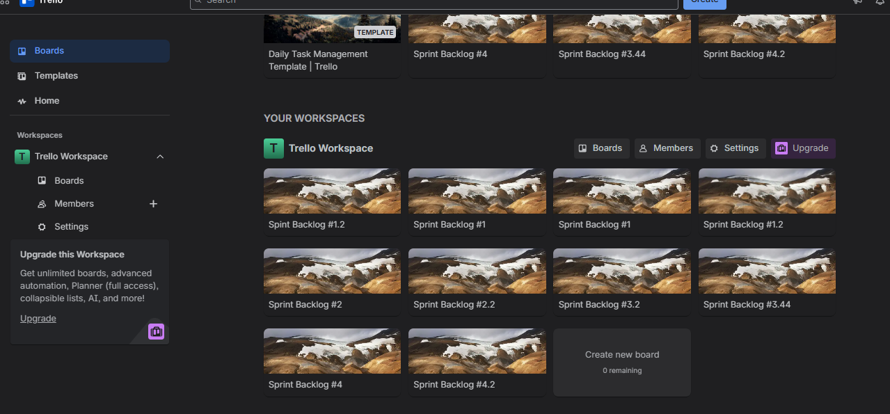
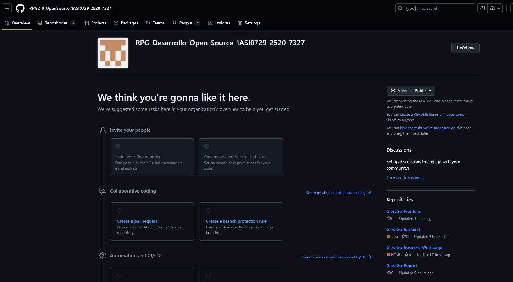
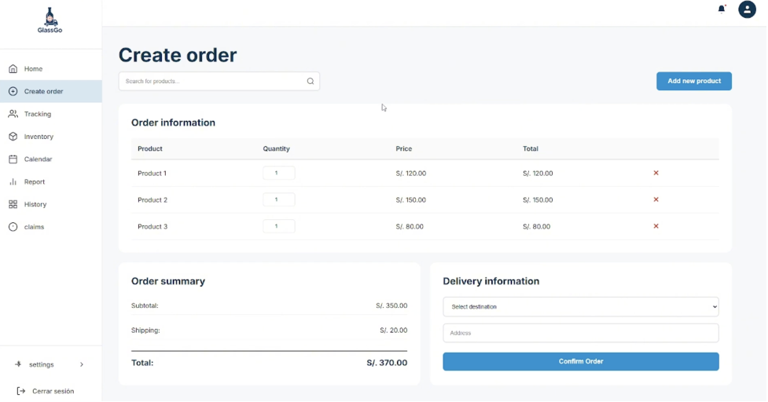
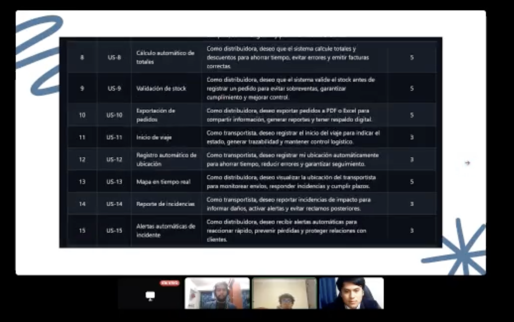

# **Anexos**

## Anexo A. Figma de diseños

- Link de Figma de diseño de la plataforma: https://tinyurl.com/3rwshbb9

## Anexo B. Trello

- Link de Trello del proyecto Sprint Backlog 1: https://tinyurl.com/yp5emm4j

- Link de Trello del proyecto Sprint Backlog 2: https://tinyurl.com/yvyuumnb

- Link de Trello del proyecto Sprint Backlog 3: https://tinyurl.com/a78xeesn

- Link de Trello del proyecto Sprint Backlog 4: https://tinyurl.com/2yshdx79

## Anexo C. Diagrama de Base de Datos

- Link del repositorio Github del proyecto: https://github.com/RPG2-0-OpenSource-1ASI0729-2520-7327

## Anexo D. About The Team

- Link del video: https://www.youtube.com/watch?v=Kd3LH6Srh8U

## Anexo E. About The Product

- Link del video: https://www.youtube.com/watch?v=fgSdkh02vZo

## Anexo F. TP1

- Link del video: https://youtu.be/fCHTmI3T-Vg

## Anexo G. TF1

- Link del video: 

