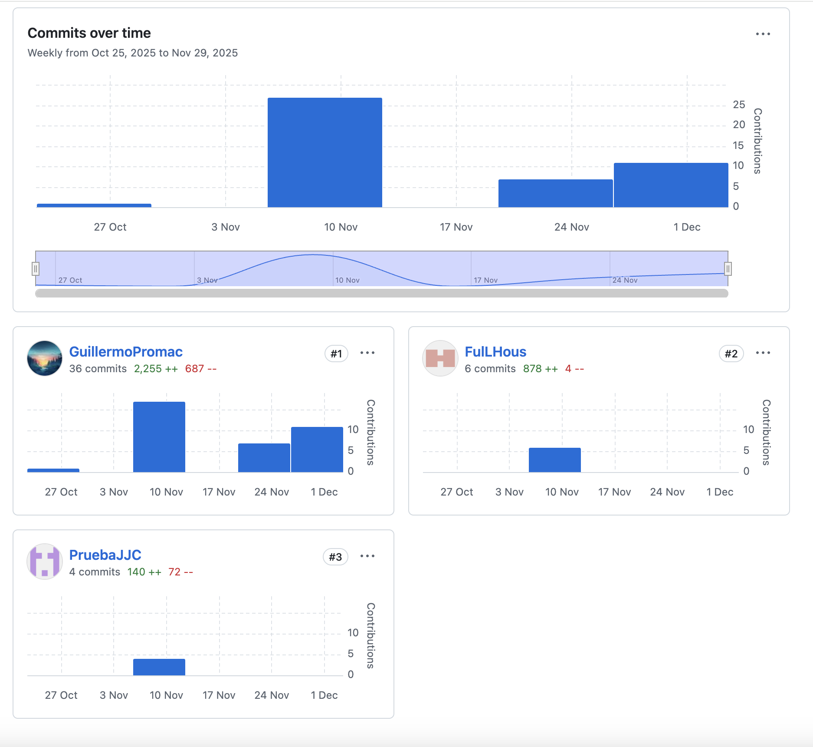

UNIVERSIDAD PERUANA DE CIENCIAS APLICADAS

Facultad de Ingeniería

Carrera de Ingeniería de Software

Ciclo: 202520

Código del curso: 1ASI0729

Nombre del curso: Desarrollo de Aplicaciones Open Source

NRC: 7327

DOCENTE: Ángel Augusto Velásquez Nuñez

Informe de Trabajo Final

Nombre del Startup

Nombre: RPG2.0

Nombre del Producto

Producto: GlassGo

Relación de integrantes

<table>
  <thead>
    <tr>
      <th style="background-color: #333; color: #fff;">Apellidos y Nombres</th>
      <th style="background-color: #333; color: #fff;">Código de Alumno</th>
    </tr>
  </thead>
  <tbody>
    <tr>
      <td>Howard Robles, Guillermo Arturo</td>
      <td>U202222275</td>
    </tr>
    <tr>
      <td>Cespedes Pillco, Jarod Jack</td>
      <td>U202318588</td>
    </tr>
    <tr>
      <td>Vivar Cesar, David Ignacio</td>
      <td>U202414424</td>
    </tr>
    <tr>
      <td>Guillen Giraldo Myke Dylan</td>
      <td>U202211881</td>
    </tr>
  </tbody>
</table>

MES Y AÑO

Diciembre 2025

---

# Registro de Versiones del Informe

| Versión | Fecha      | Autor                          | Descripción de modificación                                                             |
|:-------:|------------|--------------------------------|-----------------------------------------------------------------------------------------|
|   1.1   | 18/09/2025 | Mike Dylan Guillen Giraldo     | Creación de la organización en github de RPG2-0-OpenSource-1ASI0729-2520-7327           |
|   1.2   | 18/09/2025 | Mike Dylan Guillen Giraldo     | Creación del repositorio de GlassGo-Report                                              |
|   1.3   | 18/09/2025 | Mike Dylan Guillen Giraldo     | Creación de ramas para la división de los capítulos del report                          |
|   1.4   | 18/09/2025 | Guillermo Arturo Howard Robles | Desarrollo de la descripción del startup, solution profile , lean ux problem statements |
|   1.5   | 18/09/2025 | Mike Dylan Guillen Giraldo     | Desarrollo del lean ux assumptions y hypotehis statements                               |
|   1.7   | 18/09/2025 | David Ignacio Vivar Cesar      | Desarrollo del lean ux canvas, segmentos objetivos                                      |
|   2.1   | 18/09/2025 | Guillermo Arturo Howard Robles | Desarrollo de la sección de competidores, Ubiquitous Language                           |
|   2.2   | 09/10/2025 | Mike Dylan Guillen Giraldo     | Desarrollo de las secciones de entrevistas, Big Picture Event Storming                  |
|   2.3   | 09/10/2025 | David Ignacio Vivar Cesar      | Desarrollo de la sección needfinding                                                    |
|   3.1   | 09/10/2025 | Guillermo Arturo Howard Robles | Desarrollo del Product Backlog                                                          |
|   3.2   | 09/10/2025 | Mike Dylan Guillen Giraldo     | Desarrollo del Impact Mapping                                                           |
|   3.3   | 12/10/2025 | David Ignacio Vivar Cesar      | Desarrollo de los User Stories                                                          |
|   4.1   | 26/10/2025 | Guillermo Arturo Howard Robles | Desarrollo del capítulo 4                                                               |
|   4.2   | 27/10/2025 | Mike Dylan Guillen Giraldo     | Desarrollo del capítulo 4                                                               |
|   4.3   | 28/10/2025 | David Ignacio Vivar Cesar      | Desarrollo del sprint 1                                                                 |
|   4.4   | 16/11/2025 | David Ignacio Vivar Cesar      | Corrección en los capítulos 2 y 3                                                       |
|   4.5   | 17/11/2025 | Mike Dylan Guillen Giraldo     | Corrección en las secciones del Capítulo 1 y 4                                          |
|   5.1   | 19/11/2025 | Guillermo Arturo Howard Robles | Desarrollo del sprint 2                                                                 |
|   5.2   | 19/11/2025 | Jarod Jack Céspedes Pillco     | Desarrollo del sprint 3                                                                 |
|   5.3   | 20/11/2025 | Mike Dylan Guillen Giraldo     | Corrección en los sprint 1 y 2                                                          |
|   5.4   | 28/11/2025 | Guillermo Arturo Howard Robles | Desarrollo del sprint 4                                                                 |
|   6.1   | 01/12/2025 | Guillermo Arturo Howard Robles | Corrección del sprint 4                                                                 |
 
---

# Project Report Collaboration Insights

Para el desarrollo del **Project Report**, se utilizó un repositorio dentro de la organización del equipo en GitHub. A continuación, se presenta la evidencia de colaboración correspondiente, en coherencia con el Registro de Versiones del Informe.

Link Github: https://github.com/RPG2-0-OpenSource-1ASI0729-2520-7327

- Para la elaboración del informe, se crearon ramas específicas para cada sección del documento, permitiendo a los integrantes trabajar de manera simultánea y organizada, facilitando la integración de los contenidos.

- **Total de commits:** 46
- **Autores contribuyentes:**
    - Guillermo Howard (`GuillermoPromac`)
    - Vivar David (`DarkBeider20`)
    - Guillen Mike (`FulLHous`)
    - Jarod Cespedes (`PruebaJJC`)
- Actividad distribuida por ramas correspondientes a cada sección del informe.
- Todos los miembros participaron activamente en la redacción y revisión del contenido.

---

# Contenido
**Tabla de contenidos**

- [Registro de Versiones del Informe](#registro-de-versiones-del-informe)
- [Project Report Collaboration Insights](#project-report-collaboration-insights)
- [Contenido](#contenido)
- [Student Outcome 3](#student-outcome-3)
- [**Capítulo I: Introducción**](#capítulo-i-introducción)
    - [1.1. Perfil de la Startup](#11-perfil-de-la-startup)
        - [1.1.1. Descripción de la Startup](#111-descripción-de-la-startup)
        - [1.1.2. Perfiles de los Miembros del Equipo](#112-perfiles-de-los-miembros-del-equipo)
    - [1.2. Solution Profile](#12-solution-profile)
        - [1.2.1. Antecedentes y Problematicas](#121-antecedentes-y-problematicas)
    - [1.2.2 Lean UX Process](#122-lean-ux-process)
        - [1.2.2.1. Lean UX Problem Statements](#1221-lean-ux-problem-statements)
        - [1.2.2.2. Lean UX Assumptions](#1222-lean-ux-assumptions)
        - [1.2.2.3. Lean UX Hypothesis Statements](#1223-lean-ux-hypothesis-statements)
        - [1.2.2.4. Lean UX Canvas](#1224-lean-ux-canvas)
    - [1.3. Segmentos Objetivo](#13-segmentos-objetivo)
- [**Capítulo II: Requirements Elicitation \& Analysis**](#capítulo-ii-requirements-elicitation--analysis)
    - [2.1. Competidores.](#21-competidores)
        - [2.1.1. Análisis competitivo.](#211-análisis-competitivo)
        - [2.1.2. Estrategias y tácticas frente a competidores.](#212-estrategias-y-tácticas-frente-a-competidores)
    - [2.2. Entrevistas.](#22-entrevistas)
        - [2.2.1. Diseño de entrevistas.](#221-diseño-de-entrevistas)
        - [2.2.2. Registro de entrevistas.](#222-registro-de-entrevistas)
        - [2.2.3. Análisis de entrevistas.](#223-análisis-de-entrevistas)
    - [2.3. Needfinding.](#23-needfinding)
        - [2.3.1. User Personas.](#231-user-personas)
        - [2.3.2. User Task Matrix.](#232-user-task-matrix)
        - [2.3.3. User Journey Mapping.](#233-user-journey-mapping)
        - [2.3.4. Empathy Mapping.](#234-empathy-mapping)
    - [2.4. Big Picture Event Storming.](#24-big-picture-event-storming)
    - [2.5. Ubiquitous Language.](#25-ubiquitous-language)
- [**Capítulo III: Requirements Specification**](#capítulo-iii-requirements-specification)
    - [3.1. User Stories](#31-user-stories)
    - [3.2. Impact Mapping](#32-impact-mapping)
    - [3.3. Product Backlog](#33-product-backlog)
- [**Capítulo IV: Product Design**](#capítulo-iv-product-design)
    - [4.1. Style Guidelines](#41-style-guidelines)
        - [4.1.1. General Style Guidelines](#411-general-style-guidelines)
        - [4.1.2. Web Style Guidelines](#412-web-style-guidelines)
    - [4.2. Information Architecture](#42-information-architecture)
        - [4.2.1. Organization Systems](#421-organization-systems)
        - [4.2.2. Labeling Systems](#422-labeling-systems)
        - [4.2.3. SEO Tags and Meta Tags](#423-seo-tags-and-meta-tags)
        - [4.2.4. Searching Systems](#424-searching-systems)
        - [4.2.5. Navigation Systems](#425-navigation-systems)
    - [4.3. Landing Page UI Design](#43-landing-page-ui-design)
        - [4.3.1. Landing Page Wireframe](#431-landing-page-wireframe)
        - [4.3.2. Landing Page Mock-up](#432-landing-page-mock-up)
    - [4.4. Web Applications UX/UI Design](#44-web-applications-uxui-design)
        - [4.4.1. Web Applications Wireframes](#441-web-applications-wireframes)
        - [4.4.2. Web Applications Wireflow Diagrams](#442-web-applications-wireflow-diagrams)
        - [4.4.3. Web Applications Mock-ups](#443-web-applications-mock-ups)
        - [4.4.4. Web Applications User Flow Diagrams](#444-web-applications-user-flow-diagrams)
    - [4.5. Web Applications Prototyping](#45-web-applications-prototyping)
    - [4.6. Domain-Driven Software Architecture](#46-domain-driven-software-architecture)
        - [4.6.1. Design-Level EventStorming](#461-design-level-eventstorming)
        - [4.6.2. Software Architecture Context Diagram](#462-software-architecture-context-diagram)
        - [4.6.3. Diagramas de Contenedor de Arquitectura de Software](#463-diagramas-de-contenedor-de-arquitectura-de-software)
        - [4.6.4. Software Architecture Components Diagrams](#464-software-architecture-components-diagrams)
    - [4.7. Software Object-Oriented Design](#47-software-object-oriented-design)
        - [4.7.1. Class Diagrams](#471-class-diagrams)
    - [4.8. Database Design](#48-database-design)
        - [4.8.1. Database Diagrams](#481-database-diagrams)
- [**Capítulo V: Product Implementation, Validation \& Deployment**](#capítulo-v-product-implementation-validation--deployment)
    - [5.1. Software Configuration Management.](#51-software-configuration-management)
        - [5.1.1. Software Development Environment Configuration.](#511-software-development-environment-configuration)
        - [5.1.2. Source Code Management.](#512-source-code-management)
        - [5.1.3. Source Code Style Guide \& Conventions.](#513-source-code-style-guide--conventions)
        - [5.1.4. Software Deployment Configuration.](#514-software-deployment-configuration)
    - [5.2. Landing Page, Services \& Applications Implementation.](#52-landing-page-services--applications-implementation)
        - [5.2.1. Sprint 1](#521-sprint-1)
            - [5.2.1.1. Sprint Planning 1.](#5211-sprint-planning-1)
            - [5.2.1.2. Aspect Leaders and Collaborators.](#5212-aspect-leaders-and-collaborators)
            - [5.2.1.3. Sprint Backlog 1.](#5213-sprint-backlog-1)
            - [5.2.1.4. Development Evidence for Sprint Review.](#5214-development-evidence-for-sprint-review)
            - [5.2.1.6. Services Documentation Evidence for Sprint Review.](#5216-services-documentation-evidence-for-sprint-review)
            - [5.2.1.7. Software Deployment Evidence for Sprint Review.](#5217-software-deployment-evidence-for-sprint-review)
            - [5.2.1.8. Team Collaboration Insights during Sprint.](#5218-team-collaboration-insights-during-sprint)
        - [5.2.2. Sprint 2](#522-sprint-2)
            - [5.2.2.1. Sprint Planning 2.](#5221-sprint-planning-2)
            - [5.2.2.2. Aspect Leaders and Collaborators.](#5222-aspect-leaders-and-collaborators)
            - [5.2.2.3. Sprint Backlog 2.](#5223-sprint-backlog-2)
            - [5.2.2.4. Development Evidence for Sprint Review.](#5224-development-evidence-for-sprint-review)
            - [5.2.2.5. Execution Evidence for Sprint Review.](#5225-execution-evidence-for-sprint-review)
            - [5.2.2.6. Services Documentation Evidence for Sprint Review.](#5226-services-documentation-evidence-for-sprint-review)
            - [5.2.2.7. Software Deployment Evidence for Sprint Review.](#5227-software-deployment-evidence-for-sprint-review)
            - [5.2.2.8. Team Collaboration Insights during Sprint.](#5228-team-collaboration-insights-during-sprint)
        - [5.2.3. Sprint 3](#523-sprint-3)
            - [5.2.3.1. Sprint Planning 3.](#5231-sprint-planning-3)
            - [5.2.3.2. Aspect Leaders and Collaborators.](#5232-aspect-leaders-and-collaborators)
            - [5.2.3.3. Sprint Backlog 3.](#5233-sprint-backlog-3)
            - [5.2.3.4. Development Evidence for Sprint Review.](#5234-development-evidence-for-sprint-review)
            - [5.2.3.5. Execution Evidence for Sprint Review.](#5235-execution-evidence-for-sprint-review)
            - [5.2.3.6. Services Documentation Evidence for Sprint Review.](#5236-services-documentation-evidence-for-sprint-review)
            - [5.2.3.7. Software Deployment Evidence for Sprint Review.](#5237-software-deployment-evidence-for-sprint-review)
            - [5.2.3.8. Team Collaboration Insights during Sprint.](#5238-team-collaboration-insights-during-sprint)
        - [5.2.4. Sprint 4](#524-sprint-4)
            - [5.2.4.1. Sprint Planning 4.](#5241-sprint-planning-4)
            - [5.2.4.2. Aspect Leaders and Collaborators.](#5242-aspect-leaders-and-collaborators)
            - [5.2.4.3. Sprint Backlog 4.](#5243-sprint-backlog-4)
            - [5.2.4.4. Development Evidence for Sprint Review.](#5244-development-evidence-for-sprint-review)
            - [5.2.4.5. Execution Evidence for Sprint Review.](#5245-execution-evidence-for-sprint-review)
            - [5.2.4.6. Services Documentation Evidence for Sprint Review.](#5246-services-documentation-evidence-for-sprint-review)
            - [5.2.4.7. Software Deployment Evidence for Sprint Review.](#5247-software-deployment-evidence-for-sprint-review)
            - [5.2.4.8. Team Collaboration Insights during Sprint.](#5248-team-collaboration-insights-during-sprint)
    - [5.3. Validation Interviews.](#53-validation-interviews)
        - [5.3.1. Diseño de Entrevistas.](#531-diseño-de-entrevistas)
        - [5.3.2. Registro de Entrevistas.](#532-registro-de-entrevistas)
        - [5.3.3. Evaluación según heurísticas.](#533-evaluación-según-heurísticas)
    - [5.4. Video About-the-Product.](#54-video-about-the-product)
- [Conclusiones y Recomendaciones](#conclusiones-y-recomendaciones)
- [Bibliografía](#bibliografía)
- [Anexos](#anexos)
---

# **Student Outcome 3**

El curso contribuye al cumplimiento del Student Outcome:

**ABET \- EAC \- Student Outcome 3:**

Criterio: Capacidad de comunicarse eficientemente con un rango de audiencias

En el siguiente cuadro se describen las acciones realizadas  y enunciados de conclusiones por parte del grupo, que permiten sustentar el haber alcanzado el logro del ABET \-- EAC \- Student Outcome 3\.

| Criterio específico | Acciones realizadas                                                                                                                                                                                                                                                                                                                                                                                                                                                                                                                                                                                                                                                                                                                                                                                                                                                                                                                                                                                                                                                                                                                                                                                                                                                                                                                                                                                               | Conclusiones                                                                                                                                                                                                                                                                                                                                                                                                                                                                                                                                                                                                                                                                                                                                                                                                                                                                                                                                                                                                                                                                                    |
| :---- |:------------------------------------------------------------------------------------------------------------------------------------------------------------------------------------------------------------------------------------------------------------------------------------------------------------------------------------------------------------------------------------------------------------------------------------------------------------------------------------------------------------------------------------------------------------------------------------------------------------------------------------------------------------------------------------------------------------------------------------------------------------------------------------------------------------------------------------------------------------------------------------------------------------------------------------------------------------------------------------------------------------------------------------------------------------------------------------------------------------------------------------------------------------------------------------------------------------------------------------------------------------------------------------------------------------------------------------------------------------------------------------------------------------------|:------------------------------------------------------------------------------------------------------------------------------------------------------------------------------------------------------------------------------------------------------------------------------------------------------------------------------------------------------------------------------------------------------------------------------------------------------------------------------------------------------------------------------------------------------------------------------------------------------------------------------------------------------------------------------------------------------------------------------------------------------------------------------------------------------------------------------------------------------------------------------------------------------------------------------------------------------------------------------------------------------------------------------------------------------------------------------------------------|
| **Comunica oralmente  con efectividad a  diferentes rangos  de audiencia.** | **Howard Robles, Guillermo Arturo**  TB1: Lideró la presentación de mock-ups y flujos funcionales a usuarios durante sesiones grupales; además, condujo entrevistas como parte del proceso de needfinding.  **TP:** Explicó objetivos y organización de tareas durante el Sprint Planning 2. **TB2:** Explicó los avances en el módulo de configuración.   **TF1:** Explicó los avances en las correcciones del report .   **David Ignacio, Vivar Cesar**  TB1: Lideró la explicación del Lean UX Canvas y su relación con hallazgos del usuario.  **TP:** Coordinó la exposición de contextos delimitados durante el Event Storming.  **TB2:** Presentó la estructura del módulo principal en el frontend.   **TF1:** Presentó la estructura del módulo final en el backend.   **Mike Dylan Guillen Giraldo**  TB1: Lideró la presentación del perfil de usuarios y user personas, enfocando en los hallazgos del proceso de necesidad.  **TP:** Explicó el Sprint Backlog 2 en reuniones de planificación.  **TB2:** Explicó el despliegue del sistema en la revisión del sprint.   **TF1:** Explicó el funcionamiento y procedimiento del frontend.  .   **Cespedes Pillco Jarod Jack**   TB2: Presentó los avances de la estructura principal del backend.    **TF1:** Explicó el despliegue del frontend. | **TB1:** Cada integrante asumió liderazgo en al menos una sección clave de comunicación oral. Esto permitió no solo desarrollar habilidades expresivas, sino también adaptar el lenguaje según el tipo de audiencia. A través de entrevistas, presentaciones de análisis, prototipos y flujos, el equipo transmitió efectivamente conceptos complejos y decisiones de diseño.   **TP:**  La participación activa y rotativa en presentaciones orales fortaleció la cohesión del grupo y la claridad de los mensajes. Los videos, reuniones y exposiciones contribuyeron a comunicar con precisión el progreso técnico y organizacional del proyecto.   **TB2:**  El equipo continuó con una comunicación oral efectiva al presentar avances técnicos, funcionales y organizacionales en diferentes contextos. La explicación de módulos específicos, el despliegue del sistema y los videos demostrativos evidencian la capacidad de comunicar de forma clara tanto entre el equipo como frente a evaluadores y usuarios.  **TF:**    En la fase final, el equipo consolidó su capacidad de comunicación oral mediante exposiciones integrales que abarcaron la explicación técnica del sistema, las decisiones de diseño, el proceso de desarrollo y los resultados finales obtenidos.. |
| **Comunica por escrito  con efectividad a  diferentes rangos  de audiencia.** | **Howard Robles, Guillermo Arturo**  TB1: Lideró la redacción de escenarios de usuario y tareas funcionales; documentó el desarrollo inicial del flujo base.  **TP:** Redactó las conclusiones del equipo y afinó la coherencia de los supuestos.  **TB2:** Redactó y corrigió entregables relacionados a clases del backend.   **TF1:** Redactó y corrigió estructura y malas prácticas presentadas en el report.   **David Ignacio, Vivar Cesar**  TB1: Lideró la elaboración escrita del Lean UX Canvas y síntesis de hallazgos.  **TP:** Redactó reflexiones del equipo sobre colaboración durante el Sprint.  **TB2:** Redactó el Sprint Backlog 3 y contribuyó con las evidencias de desarrollo.   **TF1:** Redactó y corrigió el backend .   **Mike Dylan Guillen Giraldo**  TB1: Lideró la documentación del proceso de entrevistas y validación de usuarios.  **TP:** Documentó las evidencias del despliegue de software para revisión técnica.  **TB2:** Redactó y corrigió entregables relacionados a heurísticas del sistema.   **TF1:** Redactó los componentes faltantes en el frontend.   **Cespedes Pillco Jarod Jack**   TB2: Documentó evidencias de desarrollo del backend.   **TF1:** Documentó evidencias de desarrollo del frontend .                                                  | **TB1:** Cada integrante tomó liderazgo en la elaboración de entregables escritos clave, garantizando una comunicación clara, precisa y estructurada. Esto permitió representar con fidelidad el trabajo realizado, desde documentos metodológicos como el Lean UX Canvas, hasta descripciones funcionales, user personas y análisis técnicos.   **TP:**  El equipo fortaleció su redacción técnica corrigiendo y mejorando entregas anteriores, lo cual se refleja en la calidad y claridad de los nuevos documentos. Cada evidencia escrita permitió comunicar adecuadamente tanto los avances del producto como el proceso seguido por el equipo.   **TB2:**  Se evidenció un avance en la precisión de los documentos técnicos y colaborativos. Las evidencias de desarrollo, actualizaciones del informe y análisis de módulos muestra la capacidad del equipo de comunicar información compleja a diferentes audiencias a través de medios escritos.   **TF:**   En la fase final, el equipo consolidó su capacidad de comunicación oral mediante exposiciones integrales que abarcaron la explicación técnica del sistema, las decisiones de diseño, el proceso de desarrollo y los resultados finales obtenidos..                                                               |

---